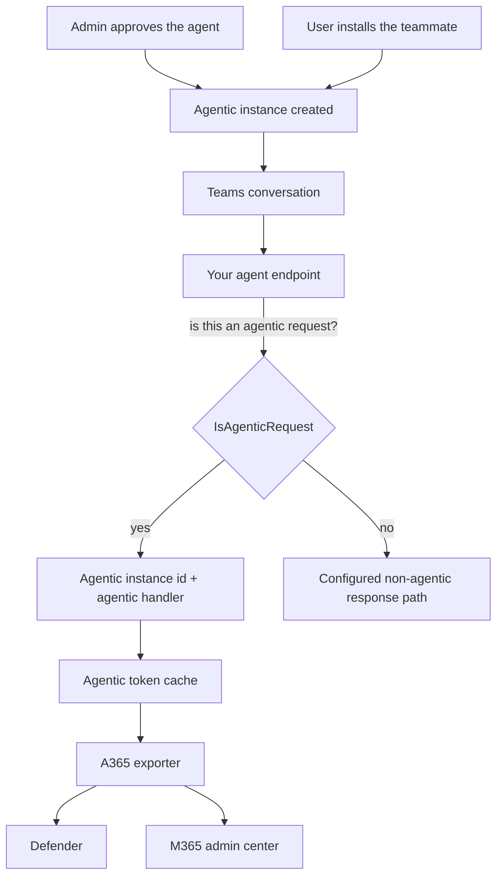

# AI Teammate: Agent Identity Overview

## Scenario Overview

**Scenario Type**: Onboarding an agent into Microsoft Agent 365 as an AI Teammate
**Agent Type**: Autonomous-capable, with its own identity
**Onboarding Path**: Agentic user, where the agent acts as itself
**Primary Tools**: Agent 365 CLI, Microsoft Entra Agent ID, Teams, OpenTelemetry; optional skills
**Stacks**: .NET Agent Framework · Python + LangChain · Node.js + LangChain
**Complexity**: Advanced
**Runbooks**: [Skill-led](3.Runbook.md) and [manual](3.Runbook-Manual.md)

Both guides support our own agent and optional educational samples. The manual route includes
registration, publishing, instance approval and instrumentation without a coding assistant.

## Problem Statement

The web OBO and custom engine Teams scenarios use a human's delegated authority. An AI Teammate
instead has its own agent user and Microsoft 365 presence. The fourth scenario,
[S2S](../Service-to-Service-Agent/1.Overview.md), also supports unattended work, but uses application
permissions without an agent user account.

An AI Teammate is installed by a person, but it is not a proxy for them. It:

- has **its own identity** in your tenant: its own object, its own mailbox, its own permissions
- can be **assigned access** the way you'd assign it to an employee
- can act when **nobody is watching**, on a schedule, or in response to an event
- is **governed as a principal in its own right**, not as an extension of whoever invoked it

That is a materially bigger step than adding telemetry to an assistant, which is why this is the
most advanced scenario here.

## Solution Summary

You take a Teams-hosted agent and publish it as an AI Teammate: an installable agent that, once
approved by a tenant admin, exists as its own identity and acts under it.

### Key Capabilities

| Capability | What it means here |
| --- | --- |
| Agent identity | The agent is a principal in Entra, with its own object id |
| Agentic instance | Each installation is a distinct instance with its own id |
| Self-directed action | The agent acts as itself, not on a user's behalf |
| Telemetry | Activity attributed to the agent, rolled up to its blueprint |
| Microsoft 365 data | Reached with the agent's own permissions |

### How It Works

An agentic turn must supply the instance identity and a token from the agentic-user handler.
Non-agentic local messages can follow the application's plain response path, but do not prove
Agent 365 telemetry; a separate human OBO route needs its own authorization.

## What makes this scenario different

### The agent id is the *agentic instance* id

Each installed teammate is a distinct instance, and `Activity.GetAgenticInstanceId()` is what identifies
it.

That id groups activity **per installed teammate**. The blueprint id then rolls that activity up,
so an admin can see both "what did this particular installation do" and "what did all installations
of this agent do".

### Token acquisition depends on the stack

On .NET, the cache can defer token acquisition through a struct containing authorization, turn
context and handler name. The manual guide resolves it before the model runs to surface token
errors during the turn. Node refreshes its built-in cache asynchronously, then gives the exporter
a synchronous getter. Python acquires the token during the turn and keeps it in a thread-safe
store for the synchronous exporter resolver.

### A turn may not be agentic

Not every activity that reaches an AI Teammate carries an agentic identity. The agent checks
`IsAgenticRequest()`, or `is_agentic_request()` and `isAgenticRequest()` on the other two stacks,
and selects the application's supported response path. A malformed agentic identity or a failed
agentic token request is an error, not a reason to fall back to a different credential.

## Why this path

Choose AI Teammate when the agent should be **a principal, not a proxy**:

| If… | Use |
| --- | --- |
| A user drives it in a web app | [Web App Agent: User OBO](../Web-App-Agent-User-OBO/) |
| A user chats with it in Teams, via your own bot | [Teams Agent: Custom Engine OBO](../Teams-Agent-Custom-Engine-OBO/) |
| It needs its own identity, mailbox and permissions | **This scenario** |
| A service or schedule triggers application-permission work without a user account | [Service-to-service](../Service-to-Service-Agent/1.Overview.md) |

> **This is a one-way door in practice.** The identity model reaches into publishing, admin
> approval and your token handling. Migrating an agent between paths later means redoing most of
> the onboarding, so decide deliberately.

## Business Outcomes

| Outcome | Why it matters |
| --- | --- |
| 🧑‍💼 **A governable colleague** | The agent is managed like a principal, not a script |
| 🔍 **Visibility** | Activity in Defender and the admin center, attributed to the agent |
| 📈 **Roll-up reporting** | Per-instance activity, aggregated to the blueprint |
| 🔐 **Its own permissions** | Access assigned to the agent, not borrowed from a user |
| ⏰ **Acts unattended** | Not limited to moments when a human is present |

## In Scope / Out of Scope

### ✅ In Scope

- Registering an agent as an AI Teammate with `--aiteammate --m365`
- Publishing it and getting through tenant-admin approval
- The agentic-user token path and the agentic token cache
- Resolving the agentic instance ID and separating agentic from legitimate non-agentic turns
- Emitting the required semantic spans
- Selecting and consenting Work IQ servers; runtime adapters and package compatibility need separate integration

### ❌ Out of Scope

- Building the agent itself
- Publishing to the public Teams store
- Scheduling and event-driven triggers
- Production hosting and CI/CD

## Target Users

| Persona | Role |
| --- | --- |
| **Agent developer** | Runs the runbook; owns the code and the manifest |
| **Tenant / Global admin** | Approves the agent instance request, **asynchronously** |
| **Microsoft 365 admin** | Manages the teammate and its activity |
| **Security analyst** | Consumes the telemetry |

## Starting point

| Stack | Path |
| --- | --- |
| .NET Agent Framework | [`0.Resources/Starting-point/dotnet/`](0.Resources/Starting-point/dotnet/) |
| Python + LangChain | [`0.Resources/Starting-point/python/`](0.Resources/Starting-point/python/) |
| Node.js + LangChain | [`0.Resources/Starting-point/nodejs/`](0.Resources/Starting-point/nodejs/) |

All three optional samples answer Microsoft product questions through the Microsoft Learn MCP server. Both runbooks show stack-specific integration points, which we can map to our own model loop, message handlers and configuration.

## Known friction

Publishing and SDK setup have requirements separate from the agent's business logic:

| Friction | Detail |
| --- | --- |
| Admin approval is **asynchronous** | You request an instance, then wait for a human at `https://admin.cloud.microsoft/#/agents/all/requested` |
| Agent name ≤ 20 characters | The CLI appends `" Blueprint"`, and `name.short` caps at 30 |
| Omit `--authmode` with `--aiteammate` | The identity model is fixed; `s2s` and `both` are rejected, and `obo` is unnecessary |
| Register the .NET exporter token cache explicitly | Required with `Microsoft.OpenTelemetry` 1.0.7; the agent and exporter must share it |
| Local runs must run as **Production** | Otherwise the Tooling SDK demands a hand-pasted bearer token |
| Work IQ SDK version conflict | The SDK's registration services can throw `TypeLoadException` against current MCP packages |

The [skill-led](3.Runbook.md) and [manual](3.Runbook-Manual.md) guides describe the registration and
instrumentation requirements. The manual guide stops Work IQ at server selection and consent.

## Related Resources

| Resource | Link |
| --- | --- |
| Architecture and identity model | [2.Architecture.md](2.Architecture.md) |
| Skill-led runbook | [3.Runbook.md](3.Runbook.md) |
| Manual AI Teammate / Autopilot runbook | [3.Runbook-Manual.md](3.Runbook-Manual.md) |
| Sample prompts | [4.Sample-prompts.md](4.Sample-prompts.md) |
| Create an agent instance | https://learn.microsoft.com/microsoft-agent-365/developer/create-instance |
| Observability concepts | https://learn.microsoft.com/microsoft-agent-365/developer/observability-concepts |
| Finished reference agent | https://github.com/qmatteoq/agent365-demos/tree/main/dotnet-agent-teammate |

## Wrapping up

Choose this path for an agent that needs its own user account and Microsoft 365 presence.
For app-only work without that user context, use S2S. Both scenarios have a manual route, so the
identity choice is independent of access to a coding assistant.
