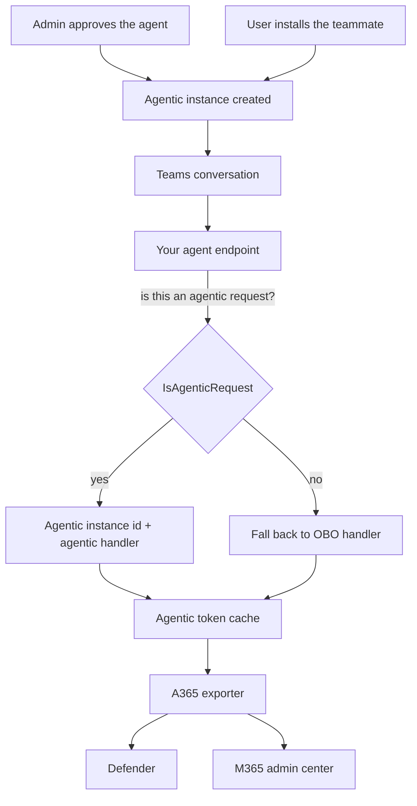

# AI Teammate: Agent Identity Overview

## Scenario Overview

**Scenario Type**: Onboarding an agent into Microsoft Agent 365 as an AI Teammate
**Agent Type**: Autonomous-capable, with its own identity
**Onboarding Path**: Agentic user, where the agent acts as itself
**Primary Tools**: Agent 365 Skills, Agent 365 CLI, Microsoft Entra Agent ID, Teams, OpenTelemetry
**Stacks**: .NET Agent Framework · Python + LangChain · Node.js + LangChain
**Complexity**: Advanced
**Status**: 🚧 In progress

## Problem Statement

The two other scenarios in this repo share an assumption: **a human is present, and the agent
borrows that human's authority.** Every action is delegated. The agent can never do anything the
signed-in user couldn't do themselves.

That's the right model for an assistant. It's the wrong model for a *colleague*.

An AI Teammate is installed by a person, but it is not a proxy for them. It:

- has **its own identity** in your tenant: its own object, its own mailbox, its own permissions
- can be **assigned access** the way you'd assign it to an employee
- can act when **nobody is watching**, on a schedule, or in response to an event
- is **governed as a principal in its own right**, not as an extension of whoever invoked it

That is a materially bigger step than adding telemetry to an assistant, which is why this is the
most advanced scenario here.

## Solution Summary

You take a Teams-hosted agent and publish it as an AI Teammate: an installable agent that, once
approved by a tenant admin, exists as its own identity and acts under it.

### Key Capabilities

| Capability | What it means here |
| --- | --- |
| Agent identity | The agent is a principal in Entra, with its own object id |
| Agentic instance | Each installation is a distinct instance with its own id |
| Self-directed action | The agent acts as itself, not on a user's behalf |
| Telemetry | Activity attributed to the agent, rolled up to its blueprint |
| Microsoft 365 data | Reached with the agent's own permissions |

### How It Works

## What makes this scenario different

### The agent id is the *agentic instance* id

Each installed teammate is a distinct instance, and `Activity.GetAgenticInstanceId()` is what identifies
it.

That id groups activity **per installed teammate**. The blueprint id then rolls that activity up,
so an admin can see both "what did this particular installation do" and "what did all installations
of this agent do".

### The token is deferred, not fetched

The other two scenarios acquire a token and store it. On .NET here you register a small struct that
captures **the means** of getting a token: the authorization object, the turn context, the handler
name. The cache resolves it lazily when the exporter needs it. Node.js gets a version of the same
idea from the built-in `AgenticTokenCache`, whose synchronous getter the exporter can call directly.
Python is the odd one out: its cache cannot be wired to the exporter, so the token is fetched during
the turn and kept in a dictionary of your own.

### A turn may not be agentic

Not every activity that reaches an AI Teammate carries an agentic identity. The agent checks
`IsAgenticRequest()`, or `is_agentic_request()` and `isAgenticRequest()` on the other two stacks,
and falls back to an OBO handler when it isn't. Your code has to handle both.

## Why this path

Choose AI Teammate when the agent should be **a principal, not a proxy**:

| If… | Use |
| --- | --- |
| A user drives it in a web app | [Web App Agent: User OBO](../Web-App-Agent-User-OBO/) |
| A user chats with it in Teams, via your own bot | [Teams Agent: Custom Engine OBO](../Teams-Agent-Custom-Engine-OBO/) |
| It needs its own identity, mailbox and permissions | **This scenario** |

> **This is a one-way door in practice.** The identity model reaches into publishing, admin
> approval and your token handling. Migrating an agent between paths later means redoing most of
> the onboarding, so decide deliberately.

## Business Outcomes

| Outcome | Why it matters |
| --- | --- |
| 🧑‍💼 **A governable colleague** | The agent is managed like a principal, not a script |
| 🔍 **Visibility** | Activity in Defender and the admin center, attributed to the agent |
| 📈 **Roll-up reporting** | Per-instance activity, aggregated to the blueprint |
| 🔐 **Its own permissions** | Access assigned to the agent, not borrowed from a user |
| ⏰ **Acts unattended** | Not limited to moments when a human is present |

## In Scope / Out of Scope

### ✅ In Scope

- Registering an agent as an AI Teammate with `--aiteammate --m365`
- Publishing it and getting through tenant-admin approval
- The agentic-user token path and the agentic token cache
- Resolving the agentic instance id, and the non-agentic fallback
- Emitting the required semantic spans
- Adding Work IQ tools, and the version conflict you may hit

### ❌ Out of Scope

- Building the agent itself
- Publishing to the public Teams store
- Scheduling and event-driven triggers
- Production hosting and CI/CD

## Target Users

| Persona | Role |
| --- | --- |
| **Agent developer** | Runs the runbook; owns the code and the manifest |
| **Tenant / Global admin** | Approves the agent instance request, **asynchronously** |
| **Microsoft 365 admin** | Manages the teammate and its activity |
| **Security analyst** | Consumes the telemetry |

## Starting point

| Stack | Path |
| --- | --- |
| .NET Agent Framework | [`0.Resources/Starting-point/dotnet/`](0.Resources/Starting-point/dotnet/) |
| Python + LangChain | [`0.Resources/Starting-point/python/`](0.Resources/Starting-point/python/) |
| Node.js + LangChain | [`0.Resources/Starting-point/nodejs/`](0.Resources/Starting-point/nodejs/) |

All three are the same agent, answering the same questions from the same Microsoft Learn MCP server, and the runbook covers all of them. Where the SDK calls differ, and in the observability phase they differ quite a lot, the step shows each language separately.

## Known friction

These are real, and it's better to know before you start than to discover them at step 14:

| Friction | Detail |
| --- | --- |
| Admin approval is **asynchronous** | You request an instance, then wait for a human at `https://admin.cloud.microsoft/#/agents/all/requested` |
| Agent name ≤ 20 characters | The CLI appends `" Blueprint"`, and `name.short` caps at 30 |
| `--authmode` is rejected with `--aiteammate` | The identity model is fixed; passing both is an error |
| The exporter token cache isn't auto-registered | Contrary to the skill reference. Without it, **the host fails to start** |
| Local runs must run as **Production** | Otherwise the Tooling SDK demands a hand-pasted bearer token |
| Work IQ SDK version conflict | The SDK's registration services can throw `TypeLoadException` against current MCP packages |

All are covered in [3.Runbook.md](3.Runbook.md).

## Related Resources

| Resource | Link |
| --- | --- |
| Architecture and identity model | [2.Architecture.md](2.Architecture.md) |
| The step-by-step runbook | [3.Runbook.md](3.Runbook.md) |
| Sample prompts | [4.Sample-prompts.md](4.Sample-prompts.md) |
| Create an agent instance | https://learn.microsoft.com/microsoft-agent-365/developer/create-instance |
| Observability concepts | https://learn.microsoft.com/microsoft-agent-365/developer/observability-concepts |
| Finished reference agent | https://github.com/qmatteoq/agent365-demos/tree/main/dotnet-agent-teammate |
