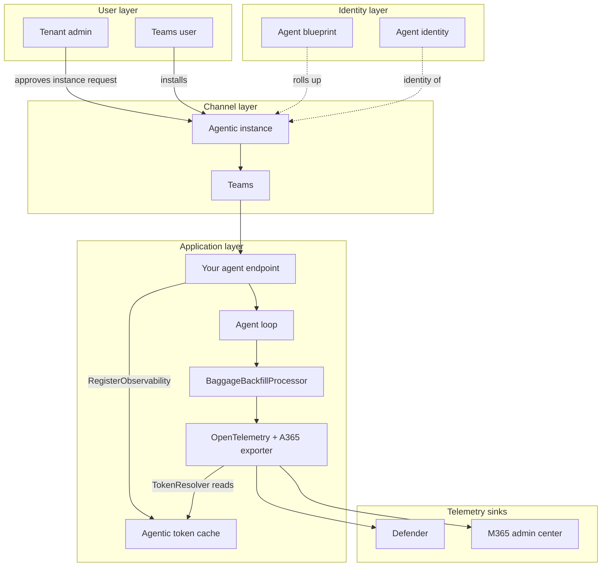
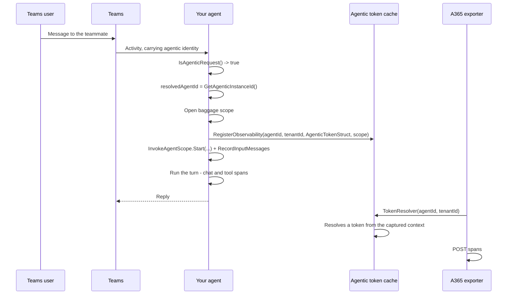
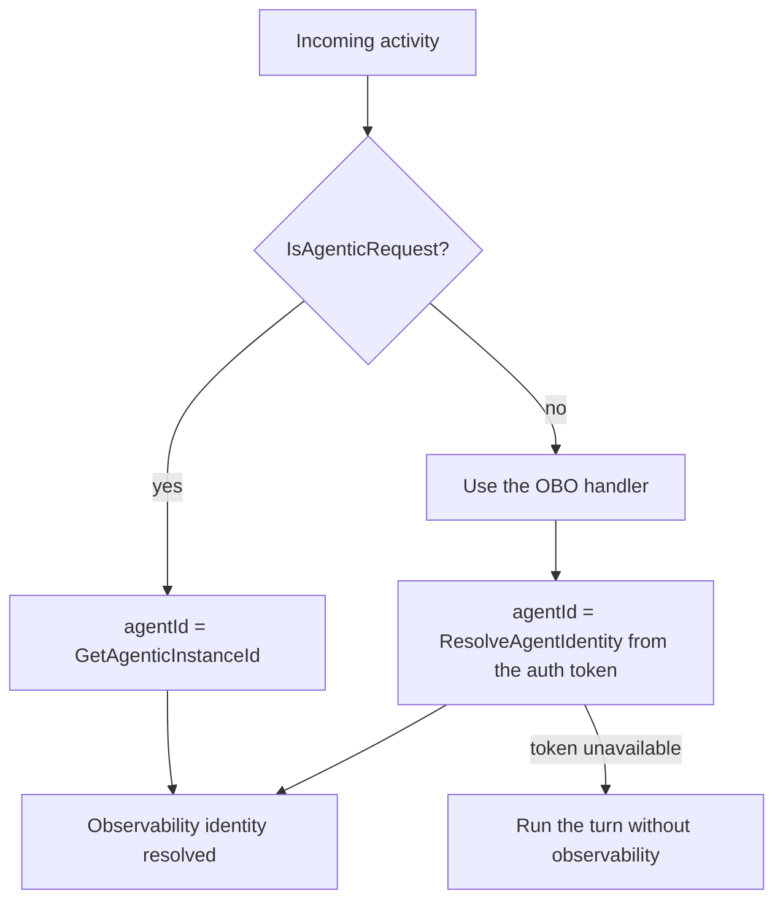

# AI Teammate — Agent Identity — Architecture

## 1. Logical Architecture



## 2. Key Components

| Component | Technology | Role |
| --- | --- | --- |
| Agent blueprint | Entra agentic app | The published agent definition; activity rolls up to it |
| Agentic instance | Entra Agent ID | **One installed teammate.** Its id is the observability agent id |
| Agentic token cache | `IExporterTokenCache<AgenticTokenStruct>` | Resolves the exporter's token lazily, per (agent, tenant) |
| `BaggageBackfillProcessor` | Your code | Puts identity on spans before the exporter reads them |
| A365 exporter | `Microsoft.OpenTelemetry` | Ships spans on a background loop |

### Which id goes where

| Id | Source | Used as |
| --- | --- | --- |
| **Agentic instance id** | `Activity.GetAgenticInstanceId()` | `gen_ai.agent.id` — groups activity per installed teammate |
| **Blueprint id** | Configuration | `agent_blueprint_id` — rolls instance activity up |
| Agent identity | `a365.generated.config.json` | The Entra object behind the instance |

> Compare with the other scenarios: the web-app path uses the **agent identity**, the custom-engine
> path uses the **bot app registration**, and this path uses the **agentic instance**. Three
> scenarios, three different answers to "what is `gen_ai.agent.id`?" — which is exactly why it's
> worth checking rather than assuming.

## 3. Data Flow

### Scenario A — An agentic turn



### Scenario B — The deferred token

The other scenarios fetch a token and store the string. Here you store **the means to get one**:

```csharp
_tokenCache?.RegisterObservability(
    resolvedAgentId!,
    resolvedTenantId!,
    new AgenticTokenStruct(
        userAuthorization: UserAuthorization,
        turnContext: turnContext,
        authHandlerName: authHandlerName ?? string.Empty),
    EnvironmentUtils.GetObservabilityAuthenticationScope());
```

The struct captures the authorization object, the turn context and the handler name. The cache
resolves an actual token when the exporter asks:

```csharp
o.Agent365.TokenResolver = (agentId, tenantId) =>
    agenticTokenCache.GetObservabilityToken(agentId, tenantId);
```

> ⚠️ **`UseMicrosoftOpenTelemetry` does not register `IExporterTokenCache<AgenticTokenStruct>`
> itself** — verified against `Microsoft.OpenTelemetry` 1.0.7, and contrary to the skill's reference
> documentation. You must register it yourself, or **the host fails to start**. This is a hard
> failure at startup, not a silent telemetry gap, so you'll find it immediately.

### Scenario C — Not every turn is agentic



You configure two handlers — an agentic one and an OBO one — and the agent picks between them per turn. When
neither yields an identity, it **still answers the question** and skips observability for that
turn. Losing a trace is not a reason to fail a user.

### Scenario D — Baggage ordering

`FromTurnContext(turnContext)` is convenient: it supplies the human's `user.id` and `user.name`
from `Activity.From`, plus `microsoft.channel.name` and the conversation id.

But it **also writes `gen_ai.agent.id` from `Recipient.AgenticAppId`** — which is not the value
this agent wants. So the explicit values are chained **afterwards**:

```csharp
new BaggageBuilder()
    .FromTurnContext(turnContext)     // convenience, but writes an agent id
    .TenantId(resolvedTenantId!)
    .AgentId(resolvedAgentId!)        // chained after, so it wins
    .AgentName(...)
    .AgentBlueprintId(...)
    .ConversationId(conversationId)
    .SessionId(conversationId)
    .Build()
```

`BaggageBuilder` keeps a single dictionary and **the last `Set` for a key survives**. Reverse the
order and the agent id silently reverts to `AgenticAppId` — which stays wrong on email-triggered
turns in particular.

### Scenario E — Processor registration order

```csharp
// BEFORE UseMicrosoftOpenTelemetry
builder.Services.AddOpenTelemetry()
    .WithTracing(tracing => tracing.AddProcessor(new BaggageBackfillProcessor()));

builder.UseMicrosoftOpenTelemetry(o => { ... });
```

`OnEnd` runs in registration order, so the backfill processor has to sit **ahead of** the Agent 365
export processor — the identity must be on the span before the exporter reads it. Registered the
other way round, the inference span (prompt, system instructions, completion) is dropped.

## 4. What the telemetry has to contain

| Requirement | Consequence if missing |
| --- | --- |
| A root `invoke_agent` span | Nothing in the M365 admin center; Defender shows orphan inference and tool rows |
| Baggage scope around the turn | Spans dropped — no identity group |
| `AgentId` chained **after** `FromTurnContext` | Agent id silently reverts to `AgenticAppId` |
| Backfill processor registered **first** | Inference span dropped |
| `UseFunctionInvocation()` + `UseOpenTelemetry()` on the chat client | No LLM or tool children under the agent span |
| `scope.RecordInputMessages([...])` | The question isn't recorded on the span |

### The asymmetry that explains most failures

| Sink | Ingests |
| --- | --- |
| Microsoft Defender (`CloudAppEvents`) | Every operation |
| Microsoft 365 admin center | **`invoke_agent` rows only** |

**Defender yes, admin center no** points at the `invoke_agent` span, not the export plumbing.
`HTTP 200` with an empty `partialSuccess` is still not proof of ingestion.

## 5. Security & Governance Considerations

| Area | Consideration |
| --- | --- |
| Its own identity | The agent holds permissions directly. Apply least privilege deliberately — there is no user whose authority naturally caps it |
| Admin approval | Instance creation requires a tenant admin, asynchronously. That gate is a feature |
| Blueprint secret | In user-secrets or a secret store, never in tracked configuration |
| Production locally | The agent runs as `Production` on a laptop, so `AddUserSecrets` must be added explicitly |
| Sensitive data | `EnableSensitiveData = true` records prompts and completions |
| Unattended action | An agent that can act unattended deserves a review of what it's allowed to reach |

## Related Resources

| Resource | Link |
| --- | --- |
| Scenario overview | [1.Overview.md](1.Overview.md) |
| The step-by-step runbook | [3.Runbook.md](3.Runbook.md) |
| Create an agent instance | https://learn.microsoft.com/microsoft-agent-365/developer/create-instance |
| Observability concepts | https://learn.microsoft.com/microsoft-agent-365/developer/observability-concepts |
