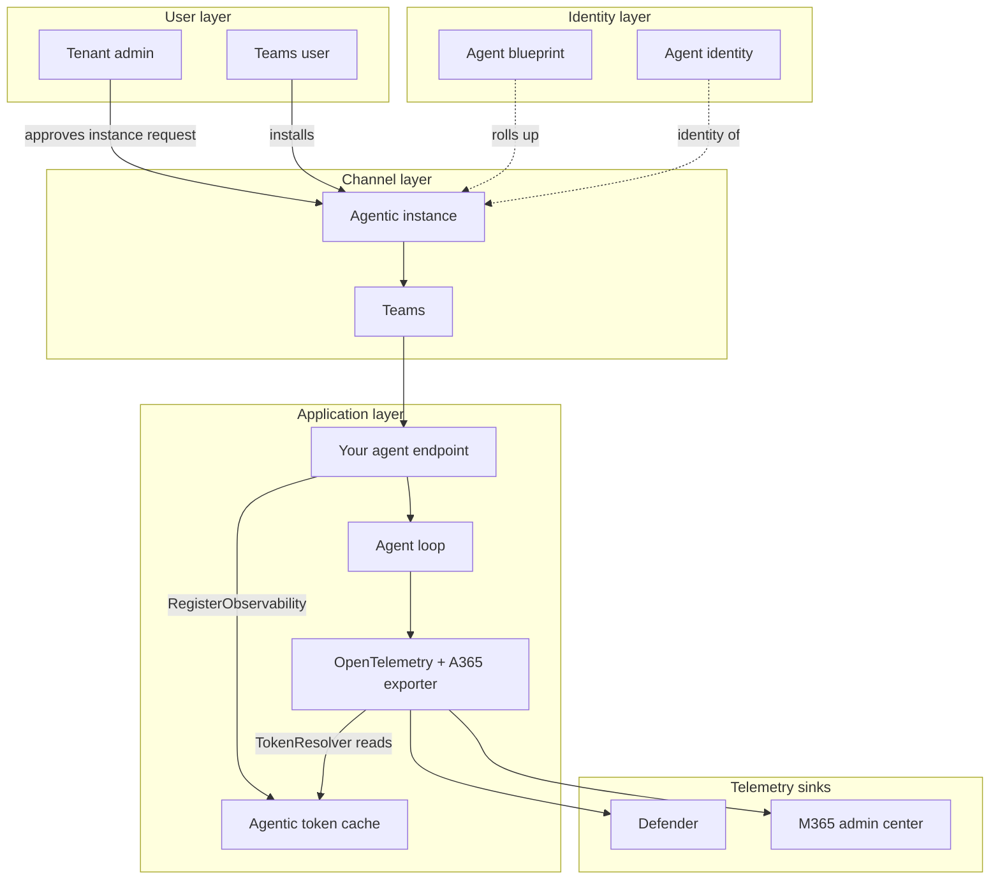
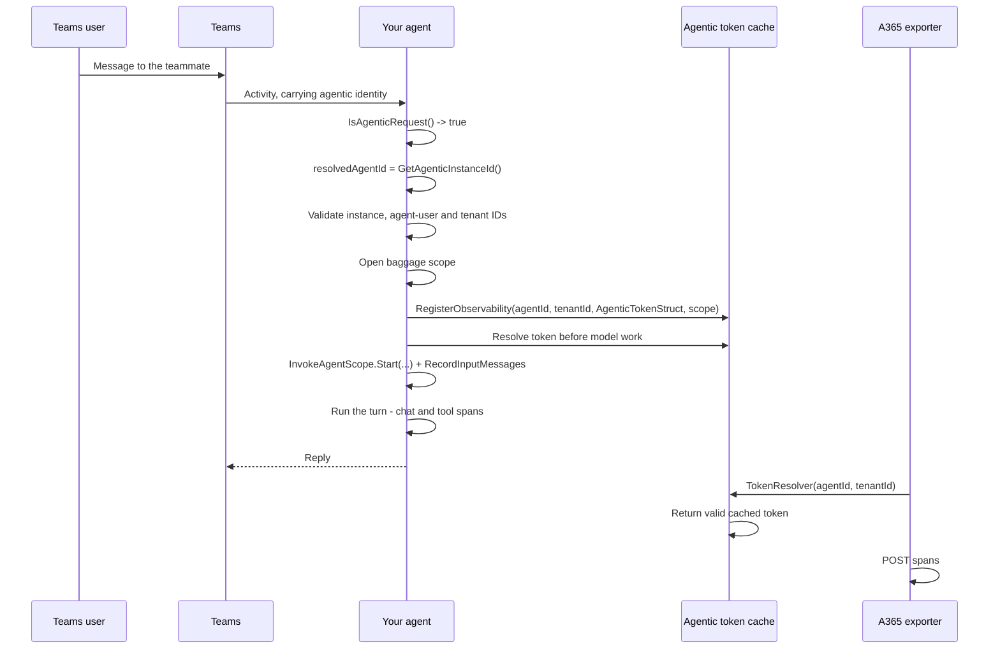
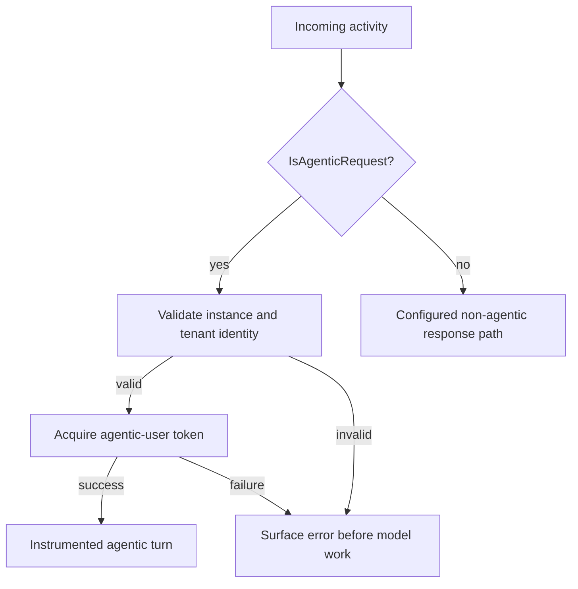

# AI Teammate: Agent Identity Architecture

This identity model applies to both the [skill-led](3.Runbook.md) and
[manual](3.Runbook-Manual.md) runbooks. The cache examples below use .NET; the guides also show
Python and Node.js token acquisition.

## 1. Logical Architecture



The blueprint governs the installed instance. Each agentic turn supplies the runtime identity
and authorization context used to obtain that instance's observability token.

## 2. Key Components

| Component | Technology | Role |
| --- | --- | --- |
| Agent blueprint | Entra agentic app | The published agent definition; activity rolls up to it |
| Agentic instance | Entra Agent ID | One installed teammate; its runtime application ID is the observability agent ID |
| Agent user | Entra user account | The teammate's own user context, separate from the human caller |
| .NET agentic token cache | `IExporterTokenCache<AgenticTokenStruct>` | Resolves the exporter's token per (agent, tenant); the manual guide warms it before model work |
| A365 exporter | `Microsoft.OpenTelemetry` | Reads identity from baggage, then ships spans on a background loop |

### Which id goes where

| Id | Source | Used as |
| --- | --- | --- |
| **Runtime instance application ID** | Authenticated activity, exposed by `Activity.GetAgenticInstanceId()` on .NET | `gen_ai.agent.id`, groups activity per installed teammate |
| **Blueprint id** | Configuration | `agent_blueprint_id`, rolls instance activity up |
| Agent user object ID | Authenticated agentic activity | Agentic-user context; this is not the runtime application ID |
| Human caller object ID | Authenticated activity sender, when a human initiated the turn | User attribution, separate from the agent's identity |

Across the four scenarios, web OBO and S2S use a child agent application's client ID, custom engine
Teams uses the bot application's client ID, and AI Teammate uses the provisioned instance's
application ID. Directory object IDs identify users or service principals for other purposes;
they do not replace the acting application ID in the export route.

## 3. Data Flow

### Scenario A: An agentic turn



The manual .NET flow resolves the token before model execution, then keeps the cache available
to the background exporter. Invalid agentic identity or failed token acquisition ends the turn
through the application's error handler.

### Scenario B: The .NET token cache

The .NET cache can store the authorization context needed to obtain a token:

```csharp
_tokenCache?.RegisterObservability(
    resolvedAgentId!,
    resolvedTenantId!,
    new AgenticTokenStruct(
        userAuthorization: UserAuthorization,
        turnContext: turnContext,
        authHandlerName: authHandlerName ?? string.Empty),
    EnvironmentUtils.GetObservabilityAuthenticationScope());
```

The struct captures the authorization object, turn context and handler name. The exporter uses
the same cache; the manual implementation also requests its token during the turn:

```csharp
o.Agent365.TokenResolver = (agentId, tenantId) =>
    agenticTokenCache.GetObservabilityToken(agentId, tenantId);
```

This resolver lets the background exporter retrieve the token associated with the same agent and
tenant. Node refreshes its built-in cache asynchronously before exposing a synchronous getter;
Python uses an application-owned token store for its synchronous exporter resolver.

> Register `IExporterTokenCache<AgenticTokenStruct>` explicitly with `Microsoft.OpenTelemetry`
> 1.0.7. The agent and exporter need the same cache instance.

### Scenario C: Not every turn is agentic



The manual guide preserves a plain response path for legitimate non-agentic local messages.
That path is not evidence of tenant instrumentation. If our application also supports human OBO,
configure and authorize it as a separate route; an agentic token error must never select it as a
fallback. Email delivery alone does not determine whether an activity is agentic.

### Scenario D: Baggage ordering

`FromTurnContext(turnContext)` is convenient: it supplies the human's `user.id` and `user.name`
from `Activity.From`, plus `microsoft.channel.name` and the conversation id.

But it **also writes `gen_ai.agent.id` from `Recipient.AgenticAppId`**, which is not the value
this agent wants. So the explicit values are chained **afterwards**:

```csharp
new BaggageBuilder()
    .FromTurnContext(turnContext)     // convenience, but writes an agent id
    .TenantId(resolvedTenantId!)
    .AgentId(resolvedAgentId!)        // chained after, so it wins
    .AgentName(...)
    .AgentBlueprintId(...)
    .ConversationId(conversationId)
    .SessionId(conversationId)
    .Build()
```

`BaggageBuilder` keeps a single dictionary and **the last `Set` for a key survives**. Reverse the
order and the agent id silently reverts to `AgenticAppId`, which stays wrong on email-triggered
turns in particular.

## 4. What the telemetry has to contain

| Requirement | Consequence if missing |
| --- | --- |
| A root `invoke_agent` span | Nothing in the M365 admin center; Defender shows orphan inference and tool rows |
| Baggage scope around the turn | Spans dropped: no identity group |
| `AgentId` chained **after** `FromTurnContext` | Agent id silently reverts to `AgenticAppId` |
| `UseFunctionInvocation()` + `UseOpenTelemetry()` on the chat client | No LLM or tool children under the agent span |
| `scope.RecordInputMessages([...])` | The question isn't recorded on the span |

### The asymmetry that explains most failures

| Sink | Ingests |
| --- | --- |
| Microsoft Defender (`CloudAppEvents`) | Every operation |
| Microsoft 365 admin center | **`invoke_agent` rows only** |

**Defender yes, admin center no** points at the `invoke_agent` span, not the export plumbing.
`HTTP 200` with an empty `partialSuccess` is still not proof of ingestion.

## 5. Security & Governance Considerations

| Area | Consideration |
| --- | --- |
| Its own identity | The agent holds permissions directly. Apply least privilege deliberately; there is no user whose authority naturally caps it |
| Admin approval | Instance creation requires a tenant admin, asynchronously. That gate is a feature |
| Blueprint secret | In user-secrets or a secret store, never in tracked configuration |
| Production locally | The agent runs as `Production` on a laptop, so `AddUserSecrets` must be added explicitly |
| Sensitive data | `EnableSensitiveData = true` records prompts and completions |
| Unattended action | An agent that can act unattended deserves a review of what it's allowed to reach |

## Related Resources

| Resource | Link |
| --- | --- |
| Scenario overview | [1.Overview.md](1.Overview.md) |
| Skill-led runbook | [3.Runbook.md](3.Runbook.md) |
| Manual runbook | [3.Runbook-Manual.md](3.Runbook-Manual.md) |
| Create an agent instance | https://learn.microsoft.com/microsoft-agent-365/developer/create-instance |
| Observability concepts | https://learn.microsoft.com/microsoft-agent-365/developer/observability-concepts |

## Wrapping up

Keep the blueprint, runtime application, agent user and human caller separate. For an app-only
background operation without an agent user, follow the
[S2S architecture](../Service-to-Service-Agent/2.Architecture.md) and its token chain instead.
