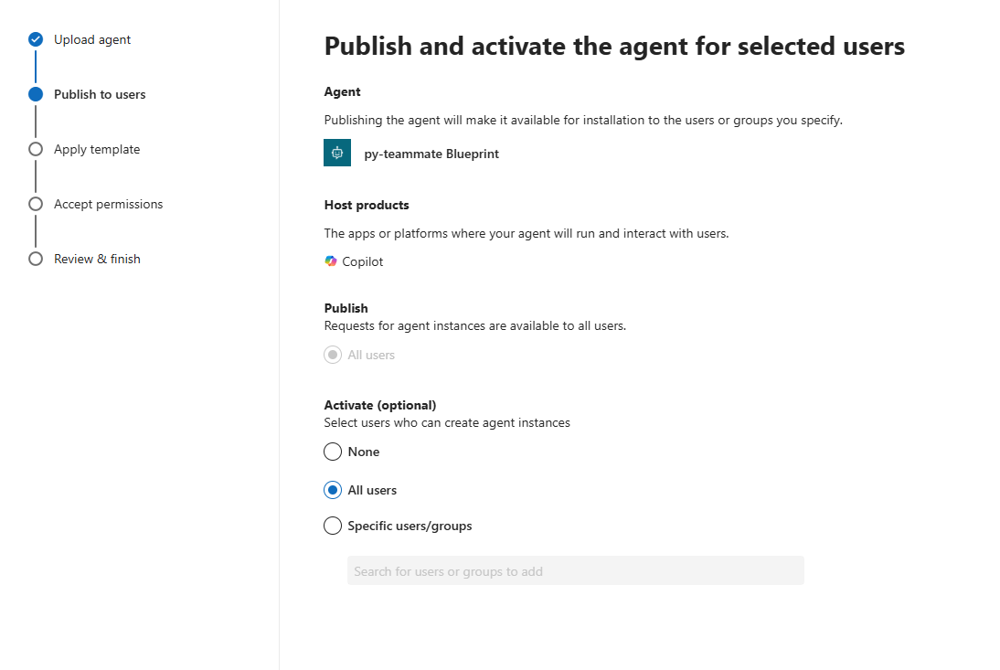
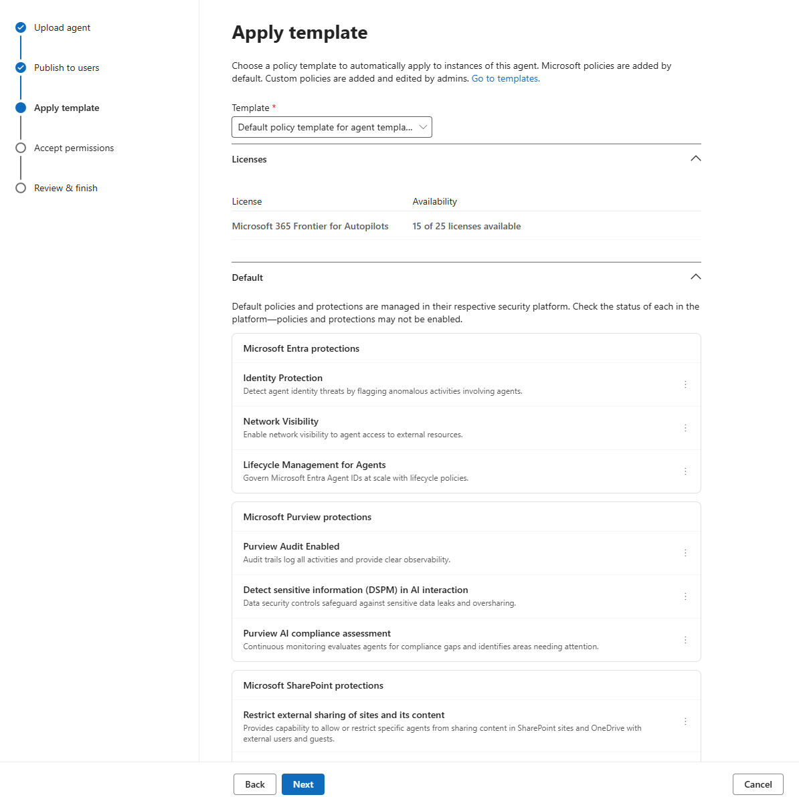
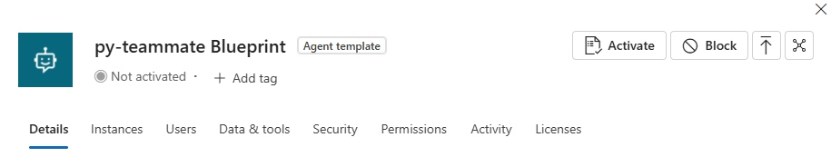
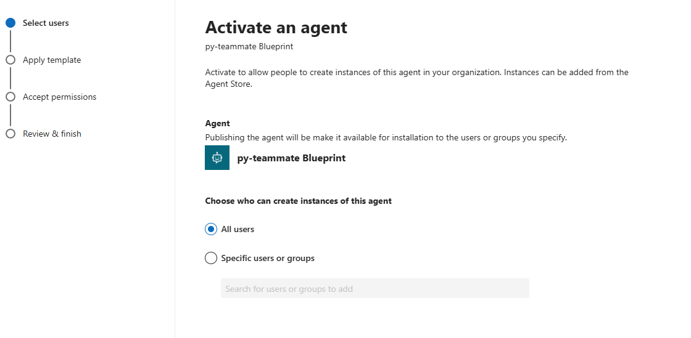
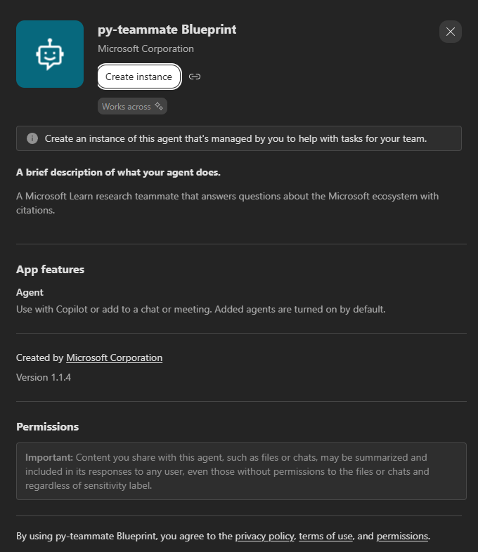

# Step-by-Step Guide: AI Teammate with Agent Identity

> **Scenario**: Publishing an agent as a Microsoft Agent 365 AI Teammate
> **Platform**: Microsoft Agent 365 · Microsoft Entra Agent ID · Teams · OpenTelemetry
> **Stack**: .NET Agent Framework · Python + LangChain · Node.js + LangChain
> **Target Readers**: Agent developers, tenant administrators
> **Last Updated**: February 2026

> ⚠️ **This scenario needs a Frontier tenant.** The AI Teammate capability is still in preview, and it is gated on your tenant being enrolled in the [Microsoft 365 Copilot Frontier program](https://www.microsoft.com/en-us/microsoft-365-copilot/frontier-program). Agent instances draw on **Microsoft 365 Frontier for Autopilots** licences, which is a pool your tenant only has if it's enrolled.

## Introduction
In this guide we're going to publish a Teams-hosted agent as an **AI Teammate**.

In the [web app](../Web-App-Agent-User-OBO/3.Runbook.md) and [Teams custom engine](../Teams-Agent-Custom-Engine-OBO/3.Runbook.md) scenarios, the agent acts *on behalf of a user*: every action it takes is attributed to the person who asked for it, and it can only reach data that person could already reach. An AI Teammate is different. It has its own identity in the tenant, in the same way a colleague does: it appears in the directory, it can be assigned permissions of its own, and its activity is attributed to *itself*, not to whoever happened to type the message.

That's a much stronger proposition, and it comes with a correspondingly stronger set of controls.

### Wait, where's the Azure Bot resource?

If you've built a Teams agent before, something about this scenario will look wrong.

The agent we're onboarding is hosted exactly like a classic custom engine agent: an ordinary web API, the Microsoft 365 Agents SDK, an `AgentApplication` handling turns, a `/api/messages` endpoint receiving activities. Even so, there is no Azure Bot resource anywhere in this guide, we never create one, and none of the starting points has a place to hold its credentials.

The Microsoft 365 Agents SDK plumbing is all still there; what's changed is *who plays the role of the bot registration*.

For a custom engine agent, the Azure Bot resource is what Teams delivers messages to, and it forwards them to your endpoint. For an AI Teammate, the blueprint itself is the registration. When you run `a365 setup all --aiteammate --m365` in Phase 1, the CLI calls the MCP Platform's `createAgentBlueprint` endpoint, which proxies Teams Graph and sets the bot's `callbackUri`, the value the Teams Developer Portal displays as **Notification URL**. Same concept, provisioned through a different control plane, with no ARM resource involved:

```text
Custom engine agent:  Teams → Azure Bot resource (ARM)      → your /api/messages
AI Teammate:          Teams → blueprint callbackUri (Graph) → your /api/messages
```

There's a second reason the Azure Bot resource isn't needed. That resource did two jobs: registering the channel, and hosting OAuth connections. Those OAuth connections are exactly what the on-behalf-of path depends on. In the [Teams custom engine scenario](../Teams-Agent-Custom-Engine-OBO/3.Runbook.md), an entire step is spent creating one just to mint the observability token. An AI Teammate doesn't need it, because it acts as its own Agentic User: tokens come from `AgenticUserAuthorization` and the built-in `AgenticTokenCache` through the agentic identity chain. No OAuth connection to host, therefore no resource to host it in.

This is why a whole category of problems from the other Teams scenario doesn't exist here:

| Custom engine agent | AI Teammate |
| --- | --- |
| A bot channel app *and* a blueprint, which must be kept strictly separate | The blueprint only |
| The blueprint can't sign channel replies (`AADSTS82001`) | Not applicable, there's no channel app to sign as |
| `a365 setup all` overwrites the bot credentials in place | Nothing to overwrite |
| Telemetry exported on behalf of the human user | Exported as the Agentic User |
| `gen_ai.agent.id` is the **bot app client id** | `gen_ai.agent.id` is the **agent instance id (AUID)** |

The export identity depends on the onboarding path. We'll use that last row again in Step 2-5.

> ⚠️ **One consequence which is important to highligght is that, w**ith no Azure Bot resource sitting in front of your endpoint, the only thing authenticating inbound activities is your own code. The starting points run in anonymous mode, `TokenValidation.Audiences` is empty on .NET, `ANONYMOUS_ALLOWED` is `true` on Python, and on Node.js it's inferred from an empty client id plus a non-production `NODE_ENV`, which is fine on your laptop and genuinely dangerous on a public tunnel: a well-formed activity from anyone who knows your URL reaches the model and burns your Azure OpenAI spend. It only fails at the very end, when the agent tries to reply through the connector API. Don't leave an anonymous endpoint exposed on a public URL, and close the gap before you demo this to anyone.

This is the skill-led guide. We'll use an AI coding assistant running the [Agent 365 Skills](https://github.com/microsoft/agent365-skills), and review the underlying CLI commands and code.

If we don't have access to a coding assistant, [3.Runbook-Manual.md](3.Runbook-Manual.md) covers the AI Teammate / Autopilot path with manual registration, publishing and instrumentation for all three stacks.

Three starting points are available, and the guide covers all of them:

| Stack | Starting point | Port |
| --- | --- | --- |
| .NET Agent Framework | [`Starting-point/dotnet`](0.Resources/Starting-point/dotnet/) | 3980 |
| Python + LangChain | [`Starting-point/python`](0.Resources/Starting-point/python/) | 3981 |
| Node.js + LangChain | [`Starting-point/nodejs`](0.Resources/Starting-point/nodejs/) | 3982 |

They are the same agent, answering the same questions from the same Microsoft Learn MCP server.

### Picking your stack

The onboarding is different in each of the three, most of all in Phase 2, so every step that varies is organized the same way: a short introduction that explains what we're doing and why, and then three subsections, **.NET**, **Python** and **Node.js**.

Here's the shape of the work. **Each phase is a valid place to stop:**

| Phase | What you get at the end of it | Rough time |
| --- | --- | --- |
| 0: Get it working | An agent answering locally in the Agents Playground | 30 to 45 min |
| 1: Registration and publishing | The agent published, approved, and installable | 60 min **+ admin wait** |
| 2: Observability | Activity in Defender and the admin center | 60 to 90 min |
| 3: Work IQ | Access to Microsoft 365 data | 30 to 60 min |
| 4: Verification | Proof that it works end to end | 30 min |

> ⏳ **Phase 1 contains a wait you don't control.** The agent instance request has to be approved by a human tenant administrator. Find that person and warn them *before* you start, or you'll be stuck in the middle of the guide waiting on someone who doesn't know you're waiting.

You'll be moving between several portals along the way. Here's the full list up front:

| Where | URL | What you'll do there |
| --- | --- | --- |
| Your terminal | Local shell | Skills, CLI, builds, the dev tunnel |
| Teams Developer Portal | https://dev.teams.microsoft.com | Agent type and notification URL. This is where the blueprint's endpoint registration lives |
| Microsoft 365 admin center | https://admin.cloud.microsoft | Package upload, blueprint activation, and agent inventory |
| The agent store | Teams → **Apps** → **Agents for your team** | Installing the teammate and requesting its instance |
| The admin approval queue | https://admin.cloud.microsoft/#/agents/all/requested | Approving the instance request |
| Microsoft Defender | https://security.microsoft.com | Advanced hunting |

Let's get started.
## Prerequisites

There are three kinds of prerequisite here, tools on your machine, licences in your tenant, permissions on your account, plus one decision you need to make before you type anything at all.
### The tools you need on your machine

| Requirement | Minimum | Check it with |
| --- | --- | --- |
| .NET SDK *(for the .NET starting point)* | 8.0 | `dotnet --version` |
| Python *(for the Python starting point)* | 3.12 | `python --version` |
| uv *(for the Python starting point)* | latest | `uv --version` |
| Node.js *(for the Node.js starting point)* | 20 | `node --version` |
| Agent 365 CLI | latest | `a365 --version` |
| Azure CLI | latest | `az version` |
| PowerShell | 7.0 | `pwsh --version` |
| Dev tunnel CLI | latest | `devtunnel --version` |

The Agent 365 CLI itself always requires the .NET SDK, because it ships as a .NET global tool. That's true even if your agent is the Python or the Node.js one, the SDK is a prerequisite of the tooling, not of your code.

Install the CLI, which ships as a .NET global tool:

```bash
dotnet tool install --global Microsoft.Agents365.CLI
a365 --version
```

### Installing the Agent 365 Skills

The skills work with every major AI coding assistant, but each one installs them differently. Find the row that matches yours:

| Your assistant | How to install |
| --- | --- |
| Claude Code (app, web or CLI) | Run `/plugin marketplace add https://github.com/microsoft/agent365-skills` in a session, then `/plugin install agent365@agent365-skills` |
| GitHub Copilot CLI, VS Code agent mode | `gh skill add microsoft/agent365-skills` |
| Cursor, Windsurf, Codex CLI, Gemini CLI, or anything else that reads `.agents/skills/` | `node /path/to/agent365-skills/scripts/install.js`, run from your agent project directory |

Run the install from your agent's project folder, so the skills can see the code they're going to change. [Installing the Skills](../../00-overview/Installing-the-Skills.md) covers each route in detail.

### The licences your tenant needs

| Requirement | What to know |
| --- | --- |
| **Frontier program enrolment** | **Required.** The AI Teammate capability is in preview and gated on it. See the note at the top of this guide. Instances consume **Microsoft 365 Frontier for Autopilots** licences from a finite pool |
| Microsoft 365 tenant | With Agent 365 enabled, and Teams. |
| Agent 365 licence | **At least one user in the tenant must hold one** |
| Azure subscription | For Azure OpenAI only, unlike the custom engine scenario, there's no Azure Bot resource to create |

That middle row causes the single most misleading failure in this guide, so it's worth checking now rather than in Phase 4: if nobody in the tenant holds a licence, your telemetry is accepted with `HTTP 200` and then silently discarded. Your logs say everything worked, Defender shows nothing at all, and nothing anywhere tells you why.

### The permissions you need

| Permission | Who needs it | What it's for |
| --- | --- | --- |
| Application Developer or higher | You | App registrations |
| **Global Administrator** | You *or* a colleague | Admin consent **and** approving the instance request |
| Teams app upload permission | You | Sideloading the app package |

> **Identify your approving administrator before you start Phase 1.** This is by far the most common place people stall, and it's frustrating precisely because it has nothing to do with your code.

---

## Phase 0: Get the agent working locally first

Before adding anything, let's confirm the agent works exactly as it is today.

Note what this phase does *not* include: creating an Azure Bot resource, pointing anything at a messaging endpoint, or even starting a dev tunnel. As we covered in the introduction, there's no bot resource in this scenario, the blueprint takes that role, and it doesn't exist until Phase 1.

Since there's no registration yet and the Teams channel isn't alive, we can test it with the **Microsoft 365 Agents Playground**. It speaks the same activity protocol Teams does, but it posts directly to your local endpoint on your own machine. So everything that isn't related to Agent 365, like the model wiring, the credentials, the MCP grounding, the conversation loop, can be verified right now.

The tunnel comes later, in Phase 1, because the only thing that ever needed it was the blueprint's endpoint registration.

### Step 0-1. Configure Azure OpenAI

The agent needs to know which model to reason with, and this part is required no matter how you authenticate.

Before the per-stack configuration, there's one decision to make that applies to all three. Each starting point supports two authentication paths and chooses between them at startup with a simple rule: if an API key is configured, it uses key auth; if not, it uses Entra credentials.

|  | **Path A: Entra credentials** *(default, recommended)* | **Path B: API key** |
| --- | --- | --- |
| What it actually uses | `DefaultAzureCredential` (.NET) or `AzureCliCredential` (Python and Node.js) locally, and a managed identity once hosted on Azure | A resource key, sent as a bearer secret |
| Extra configuration | None | The key, kept out of tracked files |
| What you need access to | The **Cognitive Services OpenAI User** role on the resource | The resource keys |
| Why you'd pick it | No long-lived secret, and it's the only option in tenants where key auth is disabled by policy | Environments that still depend on keys |

On Path A, sign in first and make sure no key is set anywhere:

```bash
az login --tenant <tenant of the Azure OpenAI resource>
```

> **Don't leave the tenant id out of the configuration below.** Without it, the credential hands back a token from whichever tenant you last signed in to, which may not be the one that owns the Azure OpenAI resource, and the service answers `HTTP 400, Tenant provided in token does not match resource token`. It reads like a code bug and isn't one.

#### .NET

In `appsettings.json`:

```jsonc
"AzureOpenAI": {
  "Endpoint": "https://<your-resource>.openai.azure.com/",
  "Deployment": "gpt-4.1",
  "TenantId": "<tenant that owns the Azure OpenAI resource>"
}
```

On Path B, the key goes outside the committed files:

```powershell
dotnet user-secrets set "AzureOpenAI:ApiKey" "<key>"   # or the AzureOpenAI__ApiKey env var
```

#### Python

In `.env`, copied from the committed `.env.example`, which is safe to commit because `.env` itself is gitignored:

```bash
AZURE_OPENAI_ENDPOINT=https://<your-resource>.openai.azure.com
AZURE_OPENAI_DEPLOYMENT=gpt-4.1
AZURE_OPENAI_API_VERSION=2024-10-21
AZURE_OPENAI_TENANT_ID=<tenant that owns the Azure OpenAI resource>
```

On Path B, add `AZURE_OPENAI_API_KEY=<key>` to the same file. On Path A, leave it out entirely rather than leaving it present and blank: an empty value still counts as configured and produces `openai.OpenAIError: Missing credentials`.

#### Node.js

Also in `.env`, copied from `.env.example`, and the key names are the same ones Python reads:

```bash
AZURE_OPENAI_ENDPOINT=https://<your-resource>.openai.azure.com
AZURE_OPENAI_DEPLOYMENT=gpt-4.1
AZURE_OPENAI_API_VERSION=2024-10-21
AZURE_OPENAI_TENANT_ID=<tenant that owns the Azure OpenAI resource>
```

`AZURE_OPENAI_DEPLOYMENT` has no default on purpose. Deployment names are chosen when the resource is created, so a guess baked into the sample would only surface later as a "deployment does not exist" error pointing at the wrong place. On Path B, add `AZURE_OPENAI_API_KEY=<key>` here too.

### Step 0-2. Check the Agents SDK configuration

There are no bot credentials to fill in, that's the whole point of this scenario, but each stack still needs a quick look before it will start, because each expresses anonymous mode differently.

Anonymous mode is what lets the agent accept activities that carry no bearer token, which is how the Agents Playground reaches it before onboarding exists. The starting point you picked already has it switched on; this step is about knowing where that switch lives, so that you recognise what changed when Phase 1 turns it off.

#### .NET

There's nothing to do. `TokenValidation:Audiences` is already empty, which is what puts the agent in anonymous mode, and there is no `Connections` section. `No connections found in configuration` in the startup logs is expected at this stage and not an error.

#### Python

The `.env.example` you just copied already contains these four keys:

```bash
CONNECTIONS__SERVICE_CONNECTION__SETTINGS__CLIENTID=
CONNECTIONS__SERVICE_CONNECTION__SETTINGS__CLIENTSECRET=
CONNECTIONS__SERVICE_CONNECTION__SETTINGS__TENANTID=
CONNECTIONS__SERVICE_CONNECTION__SETTINGS__ANONYMOUS_ALLOWED=true
```

The first three are empty on purpose, onboarding fills them in during Phase 1, but they have to be **present**. The Python `MsalConnectionManager` looks for a `SERVICE_CONNECTION` entry and raises `ValueError: No service connection configuration provided.` when it finds nothing at all. This is one of a few places where the Python SDK is stricter than .NET, which just logs a warning message without throwing any error.

`ANONYMOUS_ALLOWED` is the Python equivalent of .NET's empty `TokenValidation:Audiences`, and it's the switch that lets the Playground's unauthenticated activities through.

> **Don't skip the JWT middleware to allow anonymous calls instead.** The middleware is what attaches a `claims_identity` to the request, and the adapter reads that to decide whether the turn is anonymous. If you skip it, the turn is treated as *authenticated*, the adapter tries to build a real user token client, and the request fails with `TENANT_ID is not set in the configuration`.

#### Node.js

The same three connection keys are there, spelled the way the Node SDK parses them, plus one that looks unrelated and isn't:

```bash
Connections__ServiceConnection__Settings__ClientId=
Connections__ServiceConnection__Settings__ClientSecret=
Connections__ServiceConnection__Settings__TenantId=
NODE_ENV=development
```

Node.js has no anonymous switch of its own. Its JWT middleware grants anonymous access when there is **no client id configured** *and* `NODE_ENV` is anything other than `production`, so those two conditions together are the whole mechanism. It means anonymous mode is inferred from the absence of configuration, and it's the reason the agent will quietly stop accepting Playground traffic the moment Phase 1 writes a real client id in.

The empty keys are also more forgiving than Python's. `loadAuthConfigFromEnv` only objects when you ask it for a *named* connection that has no client id, so blank values don't stop the process starting. They're listed anyway, so that the CLI has somewhere obvious to put its values in Phase 1.

> **Don't copy the Python keys across.** The JavaScript SDK parses these names as `Connections__<id>__Settings__<property>` and splits on the double underscore, so the connection id has to be a single segment: `ServiceConnection`, not `SERVICE_CONNECTION`. A key with an extra separator in it is discarded silently rather than raising an error.

### Step 0-3. Run it and test it in the Agents Playground

Start the agent first. Whichever stack you're on, the channel endpoint ends up at `/api/messages` and there's a plain liveness string at `GET /`, and each one listens on a port of its own: 3980 for .NET, 3981 for Python and 3982 for Node.js. The Teams starting points in this repository use 3978 and 3979, so every agent in the repository can run side by side without colliding.

#### .NET

```bash
dotnet run
```

The agent listens on `http://localhost:3980`.

#### Python

```bash
uv sync
.\.venv\Scripts\python.exe -m app.main
```

The agent listens on `http://localhost:3981`. In VS Code, <kbd>F5</kbd> and the **Playground** configuration do the same thing.

#### Node.js

```bash
npm install
npm start
```

The agent listens on `http://localhost:3982`. `npm start` runs `tsx src/main.ts`, so the TypeScript is transpiled on the fly and there's no build step to wait for. In VS Code, <kbd>F5</kbd> and the **Playground (Node.js)** configuration do the same thing.

#### Then talk to it, whichever one you started

At this point there's nothing to sideload, the package is created for you in Phase 1, when `a365 publish` generates and stamps the manifest. What we *can* do is talk to the agent directly through the Microsoft 365 Agents Playground, which speaks the same activity protocol Teams does:

```bash
npm install -g @microsoft/teams-app-test-tool
teamsapptester
```

It opens a chat UI and connects to your local endpoint. Ask it something it should be able to answer:

```text
What is Microsoft Entra Conditional Access?
```

You should get an answer with links to Microsoft Learn, because this agent grounds its answers in the Microsoft Learn MCP server rather than answering from the model's own knowledge.

> The Playground works with no configuration because of the anonymous mode you looked at in Step 0-2, whichever form it takes on your stack. The Agent 365 CLI writes the real connection settings during Phase 1. This is also the mode the warning in the introduction was about: convenient locally, not something to leave exposed on a public URL.

✅ **Checkpoint.** The agent reasons correctly and answers with citations. There's no Agent 365 anything yet. That starts now.

## Phase 1: Register and publish as an AI Teammate

Registration creates a **blueprint**, the parent app registration that holds the permissions, and, once an administrator approves it, an **agent instance**, which is the identity the teammate actually acts as. The instance is the part that requires a human, and it's why this phase has a wait in the middle of it.

### Step 1-1. Start a dev tunnel

Registration is about to write your messaging endpoint into the blueprint, and Teams can't reach `localhost`, so we need a public URL that forwards to your machine *before* we run the setup skill, not after.

```bash
devtunnel host -p 3980 --allow-anonymous     # Python: -p 3981, Node.js: -p 3982
```

**Use a *named*, persistent tunnel rather than an ad-hoc one.** This is even more important here than in the other OBO scenarios in this repository. In the custom engine guide, changing the endpoint means editing a field in the Azure portal; here it means re-running the CLI and re-registering the endpoint with Teams. Create the tunnel once and reuse it:
```bash
devtunnel create my-teammate -a
devtunnel port create my-teammate -p 3980     # Python: 3981, Node.js: 3982
devtunnel host my-teammate
```

**Read the tunnel URL from the command output.** Dev tunnel URLs are not derived from the tunnel name, so you can't reconstruct or guess one. Copy it while the tunnel is running, and leave that terminal open.

Keep the agent running from Phase 0 in its own terminal, the tunnel forwards to it, it doesn't replace it.

### Step 1-2. Run the setup skill

**What you type**

```text
Set up Agent 365 for this agent as an AI Teammate. It should act under its
own identity, not on behalf of the signed-in user.
```

**What the skill does**

`a365-setup` checks the prerequisites, then, because this is an AI Teammate, hands off to `make-ai-teammate` rather than `make-a365-agent`. That skill owns the whole flow from here: the code generation, `a365.config.json`, `a365 setup all`, the manifest review, `a365 publish`, the Teams Developer Portal verification, and the instance request.

> **Notice what you're *not* asked.** There's no auth-mode question in this scenario, because the AI Teammate identity model is fixed at `agentic-user`, there's no `obo` versus `s2s` decision to make. In fact, passing `--authmode` alongside `--aiteammate` is rejected outright. If you've done one of the other scenarios and are waiting for that question, that's why it never comes.

**Behind the scenes**

```bash
a365 setup all --agent-name "my-teammate" --aiteammate --m365 \
  --messaging-endpoint https://<tunnel-host>/api/messages
```

The `--m365` flag registers the agent in the Microsoft 365 admin center, which is where an administrator will eventually go to approve it. Pass `--messaging-endpoint` in the same breath: the command will happily complete without it, but then the blueprint has no endpoint and Teams has nowhere to deliver activities, and nothing says so until you are several steps further on and wondering why the teammate never answers.

> **`setup all` stops and asks you a question, and the default answer is the wrong one.** Partway through it prints `Assign this application permission now? [y/N]:` for `Agent365.Observability.OtelWrite`, the very permission the whole of Phase 2 depends on. Press Enter and you accept `N`, and the consequence is an `HTTP 403` on export two phases later with nothing connecting it back to this prompt. Answer `y`. And because it is interactive, don't run it with redirected input: the command exits with code 1, leaves `"completed": false` in `a365.generated.config.json`, and looks like a hard failure when it was only a question you never saw.

If that has already happened to you, you don't need to start again. Re-run the permissions step on its own:

```bash
a365 setup permissions bot
```

That grants the Messaging Bot API, Observability API and Power Platform API consents in one pass. I

> ⚠️ **Check what the CLI just wrote into your configuration before you commit anything.** On .NET it puts a working client secret straight into `appsettings.json`, which is a tracked file. `.gitignore` covers `a365.generated.config.json` and `appsettings.Development.local.json`, but not that one. Tooling that pretty-prints the file tends to mask the value, so it's easy to glance at it and see nothing alarming; read the raw text instead. Python and Node.js readers get away with this one, because the equivalent value goes to `.env`, which is gitignored. If you're on .NET and this repository is going anywhere public, move the secret into user-secrets and leave a placeholder behind.

**How to verify**

```bash
node -e "console.log(require('./a365.generated.config.json').agentBlueprintId)"
```

If that prints a GUID, the blueprint exists.

> ⚠️ If you're not a Global Administrator, the setup summary printed a consent snippet. Get an administrator to run it before continuing, the permissions exist but aren't granted until someone does, and later phases fail with a consent error.

### Step 1-3. Publish the agent

```bash
a365 publish
```

This extracts a set of manifest templates into `manifest/`, updates the ids in them, and packages the result as `manifest/manifest.zip`. Upload that file at **https://admin.microsoft.com** → **Agents** → **All agents** → **Upload custom agent**. Uploading gets the agent listed, but doesn't yet make it available to anyone. Step 1-5 picks up from there.

**Customise the manifest before you upload it.** The CLI extracts the templates only when they aren't already there, so anything you edit in `manifest/manifest.json` survives the next `a365 publish` and is packaged into the new zip. The command prints the list of fields worth your attention: `name.short`, `name.full`, both descriptions, `developer.*` and the two icons, and the defaults are placeholder copy that will be visible to every administrator who reviews the agent. Bump `version` before each republish, because the admin center rejects a package whose version isn't higher than the one already uploaded.

> **The bot endpoint registration, on the other hand, is the CLI's to own: don't set it by hand.** It's tempting, because it's a single field in the Teams Developer Portal and a one-line change looks harmless. But the CLI regenerates it, so your edit is overwritten at some unpredictable later point, and what you're left with is a mismatch between what you think is deployed and what actually is.

### Step 1-4. Verify the endpoint registration in the Teams Developer Portal

This is the step where the hosting model from the introduction becomes concrete.`a365 setup all --aiteammate --m365` proxied Teams Graph and set the blueprint's bot `callbackUri` to your messaging endpoint. That registration is what replaces the Azure Bot resource, and this page is where you can see it.

Open:

```text
https://dev.teams.microsoft.com/tools/agent-blueprint/<agentBlueprintId>/configuration
```

and check two fields:

| Field | Expected value |
| --- | --- |
| **Agent Type** | **API Based** |
| **Notification URL** | Your `messagingEndpoint`, i.e. `https://<tunnel-host>/api/messages` |

**Notification URL** is simply what the Developer Portal calls the `callbackUri`. If it matches your tunnel, Teams knows where to deliver activities and the endpoint registration worked.

On supported tenants this is registered for you by `a365 setup all`, so it should already be correct. Set it by hand only if the CLI explicitly told you that automated registration wasn't available, otherwise you're fighting the tool.

> **You will need to update this later, because dev tunnel URLs can change.** The command for that is:
> ```bash
> a365 setup blueprint --endpoint-only --messaging-endpoint https://<new-host>/api/messages
> ```
> `--endpoint-only` skips blueprint creation and re-registers just the endpoint, which is what you want on an agent that already exists. There is also a `--update-endpoint <url>` flag, which does the same job as part of a fuller blueprint run. 

### Step 1-5. Request an instance

Uploading the package was not the last thing the admin center needs from you. A freshly uploaded blueprint sits there inert until somebody activates it, and until that happens it will not appear in the agent store.

Publishing and activating are two different things: **Publishing** makes the blueprint available to users, so they can ask for an instance of it. **Activating** decides who is actually allowed to create one. An agent can be published and not activated, which won't give you the chance to test your agent.

The upload wizard walks you through five stops, **Upload agent**, **Publish to users**, **Apply template**, **Accept permissions**, **Review & finish**, and activation is offered in passing on the second of them:



Note how **Publish** is fixed at **All users** while **Activate** is labelled *optional* and offers **None**, **All users** and **Specific users/groups**. If you leave that on **None**, and it's an easy thing to skim past, because nothing marks it as required, you finish the wizard with a published blueprint that nobody can instantiate. Set it to **All users** here and you save yourself the second pass entirely.

The next stop is **Apply template**, which is where policy and licensing are attached:



The default template is fine for our purposes and you can take it as offered. Notice the **Licenses** panel, because instances consume licences from a finite pool. Everything under **Default** is informational: those Entra, Purview and SharePoint protections are managed in their own consoles, and the panel is telling you which ones exist, not enabling them for you.

If you did skip activation, the blueprint's detail page tells you so plainly, though only if you look at the small grey text under the name:



**Not activated**, with an **Activate** button in the top right. Press it and you get a shorter wizard covering the same ground the first one did: **Select users**, **Apply template**, **Accept permissions**, **Review & finish**:



At the question **Choose who can create instances of this agent**, pick **All users** unless you have a reason to narrow it.

With that done, the agent appears in Teams or in the Agent Store in Copilot under **Apps** → **Agents for your team**. This is not instant, give it a few minutes before trying to follow the next steps. Its store entry looks like this:


Click on **Create instance**. You will be asked for a couple of details (the name and alias that will be assigned to the instance), then after a few minutes the instance will be provisioned and it will be ready to interact with you on Teams.
 You can now try to message it, and confirm it still answers.

**Important!** You will notice immediately a big difference between a traditional agent in Teams and AI Teammate. Traditional agents shows up as "apps" in Teams, so in order to interact with them you'll need to pick them from the Apps tab (unless you have a chat already opened). An AI Teammate instance, instead, shows up as a colleague. You will need to search for it using the Teams search bar at the top, like if you were searching for a colleague, and you won't find it under the Apps section, only the blueprint.

✅ **Checkpoint.** A good place to stop. The agent is published, approved, and exists in your tenant as its own identity.

Microsoft's own reference for this step is [Create an agent instance](https://learn.microsoft.com/microsoft-agent-365/developer/create-instance).

## Phase 2: Observability

Now we make the teammate report what it does. By the end of this phase, every turn produces telemetry attributed to the agent itself, which, remember, is the whole point of this scenario.

### Step 2-1. Run the observability skill

**What you type**

```text
Instrument this AI Teammate with Agent 365 observability.
```

The skill detects `agentType = ai-teammate` and skips the auth-mode question entirely, for the same reason Step 1-2 did: the identity model here is unambiguous.

The rest of this phase explains the changes it makes. If you ran the skill, you mostly don't need to make them by hand, read on as an explanation of the code you now have, and as a checklist when something doesn't behave.

There is one real exception, and it's the very next step. The skill will *not* register the token cache, because its own reference documentation says that the distro does that for you but, at the time of writing, it actually doesn't, so Step 2-2 is something you have to add yourself even on a freshly instrumented agent. Everything after it is explanation.

> **Treat the remaining steps as a review rather than a copy-paste exercise.** The skill may implement the same requirement under a different name than the code shown here, a differently named span processor, for instance, or baggage wired through middleware instead of explicitly. What matters is that the behaviour each step describes is present somewhere, not that the identifiers match.

### Step 2-2. Register the token cache yourself

Do this before anything else in the phase, because on .NET, without it, the host will not start at all.

The problem this step solves is the same everywhere: the exporter needs an observability token, but no token exists until a turn arrives and gives us an agentic user to fetch one for. So what we set up now is not the token, it's the place the token will eventually live and the synchronous getter the exporter will call to read it.

That last word is the one that decides how each stack solves it. The exporter calls its token resolver **synchronously**, from a background flush thread, with no coroutine handling, and the three SDKs offer different amounts of help with that constraint:

| Stack | How the exporter gets its token |
| --- | --- |
| .NET | Register the *means* to fetch one, and the built-in cache resolves it on demand |
| Python | Fetch it during the turn and put it in a dictionary of your own |
| Node.js | Refresh the built-in cache during the turn, and hand the cache's synchronous getter to the exporter |

Whichever you're on, all this step does is set up the storage. Step 2-3 hands the getter to the exporter, and Step 2-7 is where a real token finally goes in.

#### .NET

Install the package first, nothing so far has pulled it in:

```bash
dotnet add package Microsoft.OpenTelemetry
```

That is the unified distro. Everything in the rest of this phase comes from that one package.

Then register the cache:

```csharp
var agenticTokenCache = new AgenticTokenCache();
builder.Services.AddSingleton<IExporterTokenCache<AgenticTokenStruct>>(agenticTokenCache);
```

This is the registration the skill leaves out, and the reason this step is flagged as the exception. Without it the host refuses to start, with `System.ArgumentNullException: Agent365 exporter requires a TokenResolver or ContextualTokenResolver.`

#### Python

`AgenticTokenCache` does exist at that module path, and it does follow the same deferred model as .NET, but it cannot be wired to the exporter. Its accessor is `get_observability_token` and it is `async def`, so handing it to a synchronous resolver sends `****** object ...>` up the wire instead of a token.

So on Python we do the plain thing instead. Install the package first, nothing so far has pulled it in:

```bash
uv add microsoft-opentelemetry
```

Then keep a dictionary and a synchronous getter, which is all the exporter's contract actually asks for:

```python
import threading

_TOKENS: dict[str, str] = {}
_LOCK = threading.Lock()

def cache_token(tenant_id: str, agent_id: str, token: str) -> None:
    with _LOCK:
        _TOKENS[f"{agent_id}:{tenant_id}"] = token

def resolve_token(agent_id: str, tenant_id: str) -> str | None:
    with _LOCK:
        return _TOKENS.get(f"{agent_id}:{tenant_id}")
```

The lock is there because the writer is your turn and the reader is the exporter's flush thread. 

#### Node.js

The deferred cache is back, and this is the one place in the phase where Node has the best of the three. Install the distro first:

```bash
npm install @microsoft/opentelemetry
```

`AgenticTokenCache` ships in that package, exported both as a class and as a ready-made singleton, and unlike its Python namesake its accessor is genuinely synchronous, which is exactly what the exporter's token resolver contract wants:

```typescript
import { AgenticTokenCacheInstance } from "@microsoft/opentelemetry";

// getObservabilityToken(agentId, tenantId) returns `string | null` synchronously,
// so it can be handed to the exporter as-is. Step 2-3 does that; Step 2-7 fills it.
```

There is no container to register it into, so there is nothing to do here beyond importing it, and no equivalent of the .NET trap where a missing registration stops the host booting. Reach for the singleton unless you need custom scopes, in which case `new AgenticTokenCache({ authScopes: [...] })` gives you your own.

---

That was the exception. Everything from here on is a reference: the skill writes this code for you, and what follows explains what it wrote and why.

### Step 2-3. Wire the exporter into the host

Now we turn the distro on and point it at Agent 365. The following code takes care of these steps:

- **Export to Agent 365 unconditionally.** During local runs the console exporter is added *alongside* the Agent 365 one, never instead of it. It's tempting to send traces to the console locally and to Agent 365 only in production, but then local testing produces nothing you can check in Defender, and Defender is exactly where you need to look to know whether any of this worked.
- **Use the delegated endpoint, not the S2S one.** The agentic-user path posts to the delegated `/observability/` route. Its S2S counterpart accepts application tokens only and refuses a delegated one, so switching to it gets you an authorization failure with no hint as to the real cause. The flag defaults correctly on all three stacks, which means the only way to get this wrong is to set it deliberately.
#### .NET

```csharp
builder.UseMicrosoftOpenTelemetry(o =>
{
    // Unconditional: traces must reach Agent 365 even during local testing, because that
    // is what makes them visible in Defender and admin center activity.
    o.Exporters = isLocalRun
        ? ExportTarget.Agent365 | ExportTarget.Console
        : ExportTarget.Agent365;

    o.Instrumentation.EnableMetrics = false;

    // Agent365-only export suppresses infrastructure instrumentation - turn back on the
    // parts that matter so outbound calls appear in the trace.
    o.Instrumentation.EnableAspNetCoreInstrumentation = true;
    o.Instrumentation.EnableHttpClientInstrumentation = true;
    o.Instrumentation.EnableAzureSdkInstrumentation = true;

    o.Agent365.TokenResolver = (agentId, tenantId) =>
        agenticTokenCache.GetObservabilityToken(agentId, tenantId);

    // The agentic-user path posts to /observability/ - leave UseS2SEndpoint at its default.
});
```
#### Python

The same decisions are expressed as arguments to a single call:

```python
use_microsoft_opentelemetry(
    enable_a365=True,
    a365_enable_observability_exporter=True,
    a365_token_resolver=resolve_token,
    # The delegated route. Its S2S counterpart takes application tokens only and
    # refuses a delegated one - the two are not interchangeable.
    a365_use_s2s_endpoint=False,
    enable_sensitive_data=True,
    disable_metrics=True,
    # Without this the first enricher to register wins, and the LangChain one -
    # the only one that maps messages and conversation id - is skipped.
    instrumentation_options={
        "openai_agents": {"enabled": False},
        "agent_framework": {"enabled": False},
        "semantic_kernel": {"enabled": False},
    },
)
```

Four things about the Python version are worth calling out:

- **Both flags are required.** `enable_a365=True` turns the A365 distro on; `a365_enable_observability_exporter=True` turns the *exporter* on. Setting only the first was enough in earlier versions and isn't any more. With one of them missing you get a working tracer that exports nowhere.
- **This call has to run before LangChain or Azure OpenAI are imported.** The distro works by patching those libraries, and it can only patch what hasn't been imported yet. Import order in Python is a real dependency here, not a style preference. Put the call at the very top of your entry point, above the imports it needs to patch, and nothing will tell you if you get it wrong.
- **Opt the other enrichers out with `instrumentation_options`, not `disable_enrichers`.** Only the first enricher to register is used, and the LangChain one is the one that maps messages and the conversation id onto the span. If `openai_agents`, `agent_framework` or `semantic_kernel` register first, your spans arrive with the interesting fields empty. The catch is the spelling: `use_microsoft_opentelemetry` pops the arguments it recognises out of `**kwargs` and passes the rest straight through, so a plausible-looking `disable_enrichers=[...]` is accepted, ignored, and never mentioned again. `instrumentation_options` is the real mechanism, and it takes the nested dictionary above.
- **The exporter's enable flag may already be set against you.** The CLI writes `ENABLE_A365_OBSERVABILITY_EXPORTER=false` into your `.env`, along with a set of `AGENT365OBSERVABILITY__*` values. 

#### Node.js

The same two switches exist, and the load-order rule from Python applies with one important caveat: moving the call up the file doesn't fix it. ES module imports are hoisted, so every `import` in a module runs before any of that module's own statements, and a `useMicrosoftOpenTelemetry()` sitting in the body of `main.ts` executes long after `import { LearnAgent } from "./agent.js"` has already pulled LangChain in. Put the call in its own module, `src/observability.ts`:

```typescript
import { AgenticTokenCacheInstance, useMicrosoftOpenTelemetry } from "@microsoft/opentelemetry";

useMicrosoftOpenTelemetry({
    a365: {
        enabled: true,
        // Both flags are needed: `enabled` alone only registers the span processors.
        enableObservabilityExporter: true,
        // Synchronous, so the cache's own getter is a valid resolver. Step 2-7 fills it.
        tokenResolver: (agentId, tenantId) =>
            AgenticTokenCacheInstance.getObservabilityToken(agentId, tenantId) ?? "",
        // The delegated route, same reasoning as the other two stacks.
        useS2SEndpoint: false,
    },
    instrumentationOptions: {
        langchain: {},
    },
    // Writes prompts and completions onto the spans. Useful while you're learning to read
    // the telemetry, worth reconsidering before this reaches production.
    enableSensitiveData: true,
    // Also print the spans to the terminal while developing.
    enableConsoleExporters: true,
});
```

Then make it the very first import in `src/main.ts`, above the one that loads `.env`:

```typescript
import "./observability.js";
import "./env.js";

import { AgentApplication, MemoryStorage, TurnContext, TurnState } from "@microsoft/agents-hosting";
```

Note that `enableSensitiveData` and `enableConsoleExporters` sit at the top level rather than inside the `a365` block, because they apply to the whole distro rather than to the Agent 365 exporter specifically. They're the Node equivalents of `EnableSensitiveData` and the `Console` export target on .NET.

LangChain auto-instrumentation is on by default in the Node distro, so passing `instrumentationOptions.langchain` is really just making the intent explicit. For the same reason, don't also register the LangChain instrumentation by hand: doing both produces every span twice.

Finally, because Node processes usually exit on a signal rather than draining politely, flush on the way out:

```typescript
import { shutdownMicrosoftOpenTelemetry } from "@microsoft/opentelemetry";

for (const signal of ["SIGINT", "SIGTERM"] as const) {
    process.once(signal, () => {
        void shutdownMicrosoftOpenTelemetry().finally(() => process.exit(0));
    });
}
```

Without this, the last batch of spans is still sitting in the exporter's queue when the process dies, and the final turn of every debugging session goes missing.

### Step 2-4. Instrument the chat client

This is the step that produces the *contents* of a turn, the inference spans and the tool calls that hang underneath the agent span. Leave it out and you still get telemetry, but Defender shows you a record saying the agent was invoked with nothing useful underneath it.

It's also the step with the sharpest split between .NET and the other two: on .NET you opt in explicitly with a builder chain, whereas on Python and Node.js the distro's LangChain instrumentation does the job for you, provided it patched the library in time.

#### .NET

```csharp
return azureClient.GetChatClient(aoaiDeployment)
    .AsIChatClient()
    .AsBuilder()
    .UseFunctionInvocation()                                    // ExecuteToolBySDK spans
    .UseOpenTelemetry(configure: c => c.EnableSensitiveData = true)  // gen_ai.* spans
    .Build();
```

`UseFunctionInvocation` emits the `ExecuteToolBySDK` spans, and `UseOpenTelemetry` emits the `gen_ai.*` inference spans. Both are needed, and neither is on by default.

#### Python

There's no equivalent builder chain, because the distro's LangChain enricher does this job automatically once `use_microsoft_opentelemetry` has patched the library. That's precisely why the import-order rule and the enricher opt-out in the previous step matter so much: on .NET a missing chat-client instrumentation is a line of code you can see is absent, whereas here the same outcome is produced by an import that happened one line too early.

#### Node.js

Same as Python, and for the same reason: the distro's LangChain instrumentation produces the inference and tool spans once it has patched the library. The failure mode is the one from Step 2-3, an import that ran before `src/observability.ts` did, so if the `chat` spans are missing this step isn't where to look.

### Step 2-5. Understand which agent id to use

Every span this agent exports carries a `gen_ai.agent.id`. The correct value depends on the onboarding path:

| Scenario | What `gen_ai.agent.id` has to be |
| --- | --- |
| Web app, user OBO | The **agent identity** (the child principal of the blueprint) |
| Teams custom engine, OBO | The **bot app registration's client id** |
| **AI Teammate (this one)** | The **agent instance id (AUID)**, from the activity's agentic instance id |

An AI Teammate acts as itself, so the identity comes straight off the incoming activity rather than from decoding a user's token. A real agentic turn's recipient looks like this, which is worth seeing once because it settles several questions at the same time:

```python
{'id': '8:orgid:8435ef55-...', 'role': 'agenticUser',
 'agentic_user_id': '8435ef55-...',            # the Agentic User
 'agentic_app_id': '12f040dc-...',             # the agent INSTANCE - this is the AUID
 'tenant_id': '57db880c-...',
 'agenticAppBlueprintId': 'f71eb0be-...'}      # the blueprint - NOT the agent id
```

The instance id and the blueprint id are genuinely different values, and the tenant and the blueprint are both sitting right there on the activity, so none of the three stacks needs to read either of them from environment variables.

The other half of this step is knowing when there's nothing to resolve. Not every turn an AI Teammate handles is an agentic one, and a non-agentic turn carries no agentic identity at all, so the honest thing is to skip observability for it rather than invent an id. This matters more than it sounds, because **every locally generated activity is non-agentic**: a hand-rolled POST to `/api/messages`, or a turn from the Agents Playground, carries no agentic identity and no agentic token can be minted for it. Phase 2 will look broken when tested that way. Send a message from Teams to exercise the real path.

#### .NET

```csharp
var isAgentic = turnContext.Activity.IsAgenticRequest();
var authHandlerName = isAgentic ? _agenticAuthHandlerName : _oboAuthHandlerName;

string? resolvedAgentId = null;
if (isAgentic)
{
    // The AI Teammate acts as itself, so the agent id is the agentic instance id from
    // the activity - not anything decoded from a user token.
    resolvedAgentId = turnContext.Activity.GetAgenticInstanceId();
}

// A non-agentic turn carries no agentic identity at all, so there is nothing to resolve
// and nothing to attribute. Answer the user and skip observability for that turn.
```

#### Python

The same value lives on the activity's recipient, and you can read it directly:

```python
resolved_agent_id = context.activity.recipient.agentic_app_id
```

Reach for the accessors instead, though:

```python
if context.activity.is_agentic_request():
    resolved_agent_id = context.activity.get_agentic_instance_id()
    resolved_tenant_id = context.activity.get_agentic_tenant_id()
```

The difference is what happens on a turn that isn't agentic. Reaching into `recipient` gives you whatever is there, often `None`, occasionally something stale, whereas `get_agentic_instance_id()` checks `is_agentic_request()` first and returns `None` honestly.

#### Node.js

The accessors carry the same names in camel case, and they behave identically:

```typescript
if (context.activity.isAgenticRequest()) {
    resolvedAgentId = context.activity.getAgenticInstanceId();
    resolvedTenantId = context.activity.getAgenticTenantId();
}
```

`isAgenticRequest()` checks the recipient's role for `agenticUser` or `agenticIdentity`, and `getAgenticInstanceId()` returns `recipient.agenticAppId` only when that check passes, so the guard is built in rather than something you have to remember. `getAgenticTenantId()` falls back to the conversation's tenant when the recipient carries none, which is the small convenience that saves you reading it out of the environment.

### Step 2-6. Open a baggage scope

Baggage is how OpenTelemetry carries contextual values alongside the execution context, and Agent 365 uses it to carry the identity dimensions it partitions telemetry on. The builder is the same fluent chain in all three stacks, and the values going into it are the same too: the tenant, the agent id you resolved in Step 2-5, a display name, the blueprint id, and the conversation doubling as the session.

#### .NET

```csharp
using IDisposable? baggageScope = hasObservabilityIdentity
    ? new BaggageBuilder()
        .FromTurnContext(turnContext)   // user.id, user.name, channel, conversation
        .TenantId(resolvedTenantId!)
        .AgentId(resolvedAgentId!)      // chained AFTER, so it wins
        .AgentName(baggageConfig["AgentName"] ?? "LearnTeammateAgent")
        .AgentBlueprintId(baggageConfig["AgentBlueprintId"] ?? string.Empty)
        .ConversationId(conversationId)
        .SessionId(conversationId)
        .Build()
    : null;
```

> **The chaining order here matters.** `FromTurnContext` is convenient, it fills in the user, the channel and the conversation from the activity in one call, but it *also* writes `gen_ai.agent.id`, taking it from `Recipient.AgenticAppId`. So your explicit `.AgentId(...)` has to be chained after it, because `BaggageBuilder` keeps a single dictionary and the last `Set` wins. Reverse the two and the agent id silently reverts to the wrong value, most visibly on email-triggered turns.

Two values are *not* supplied by `FromTurnContext`, because the activity simply doesn't carry them: the blueprint id and the session id, so you must set them by yourself.

#### Python

The scope is a `with` block and everything inside it inherits the baggage:

```python
with (
    BaggageBuilder()
    .tenant_id(resolved_tenant_id)
    .agent_id(resolved_agent_id)
    .agent_name("LearnTeammateAgent")
    .agent_blueprint_id(agent_blueprint_id)
    .conversation_id(conversation_id)
    .session_id(conversation_id)
    .build()
):
    ...
```

#### Node.js

`build()` again produces the scope. What differs is how the scope is entered: there is no `with` and no `using` in plain TypeScript, so the scope hands you a `run` method and everything that should inherit the baggage goes inside the callback:

```typescript
const scope = new BaggageBuilder()
    .tenantId(resolvedTenantId)
    .agentId(resolvedAgentId)
    .agentName("LearnTeammateAgent")
    .agentBlueprintId(agentBlueprintId)
    .conversationId(conversationId)
    .sessionId(conversationId)
    .build();

const answer = await scope.run(() => handleTurn(context, question));
```

`run` is generic over the callback's return type, so an `async` callback comes back as a promise you can await, and the baggage stays attached across the awaits inside it because the distro rides on Node's `AsyncLocalStorage`.

There is also a shortcut here that the other two stacks don't offer. `configureA365Hosting(adapter, { enableBaggage: true })` installs a middleware that builds this baggage from the turn for you, which is closer to .NET's `FromTurnContext` in spirit. It's a reasonable choice for a real agent. We're doing it by hand in this guide because the explicit version is what makes the identity decision from Step 2-5 visible, and that decision is the whole point of this scenario.

### Step 2-7. Register the deferred token

This is where a real observability token finally reaches the storage we set up in Step 2-2, and it's the longest step in the phase because the three stacks diverge here.

They divide into two models. On .NET you register the *means* to obtain a token and nothing is fetched until the exporter asks. On Python and Node.js you acquire the token during the turn and put it away. 

One thing is true of all three: wrap the call in a `try`/`catch` that logs and carries on. A lost trace should never block the execution of the agent.

#### .NET

```csharp
_tokenCache?.RegisterObservability(
    resolvedAgentId!,
    resolvedTenantId!,
    new AgenticTokenStruct(
        userAuthorization: UserAuthorization,
        turnContext: turnContext,
        authHandlerName: authHandlerName ?? string.Empty),
    EnvironmentUtils.GetObservabilityAuthenticationScope());
```

In .NET you're registering the means to obtain a token, not a token, which means that nothing is fetched at this point. The cache resolves it later, on demand, when the exporter's `TokenResolver` from Step 2-3 asks for one.

The deferred generator you just registered exchanges the token the turn already holds, and the turn only holds one if the route that handled it was registered with an auto sign-in handler. If you registered the message route the plain way:

```csharp
OnActivity(ActivityTypes.Message, OnMessageAsync, rank: RouteRank.Last);
```

then register it twice instead, once for agentic turns and once for everything else, handing each its handler:

```csharp
string[] agenticHandlers = string.IsNullOrWhiteSpace(agenticAuthHandlerName) ? [] : [agenticAuthHandlerName];
string[] oboHandlers = string.IsNullOrWhiteSpace(oboAuthHandlerName) ? [] : [oboAuthHandlerName];

OnActivity(ActivityTypes.Message, OnMessageAsync,
    isAgenticOnly: true, autoSignInHandlers: agenticHandlers, rank: RouteRank.Last);
OnActivity(ActivityTypes.Message, OnMessageAsync,
    isAgenticOnly: false, autoSignInHandlers: oboHandlers, rank: RouteRank.Last);
```

The two handler names come from `AgentApplication:AgenticAuthHandlerName` and `AgentApplication:OboAuthHandlerName`, which Phase 1 wrote into `appsettings.json` for you. The starting point ships with this already in place, so if you haven't touched the constructor you have nothing to do here.

#### Python

You acquire the token during the turn and put it in the dictionary from Step 2-2, rather than registering the means to acquire one later.


```python
# Looks right. Always returns an empty token.
exaau_token = await agent_app.auth.exchange_token(
    context, scopes=[observability_scope], auth_handler_id="AGENTIC",
)
```

`exchange_token` only calls the auth handler when a token is **already cached for the turn**, and that cache is populated by a completed sign-in. From an ordinary message handler nothing has signed in, so the method returns an empty `TokenResponse` without ever consulting the handler. No exception, no warning, and the first sign of trouble is an `HTTP 400` from the export endpoint complaining about a tenant id.

The handler signs in with the scopes the CLI wrote into `.env`, which are Graph's, and the agent instance has no consent for Graph. Sign-in fails with `AADSTS65001 ... consent_required`, and a failed sign-in means your handler never runs. The user watches the typing indicator and then gets nothing at all, with no error anywhere they can see.

What works is to ask the agentic handler directly, with the scope you actually want:

```python
handler = agent_app.auth._resolve_handler("AGENTIC")
exaau_token = await handler.get_agentic_user_token(context, [observability_scope])

if exaau_token and exaau_token.token:
    cache_token(resolved_tenant_id, resolved_agent_id, exaau_token.token)
```

`get_agentic_user_token` is what makes this the Agentic User path. The token comes back issued to the teammate itself, not to the person who typed the message.

> **The handler is called `AGENTIC`, not `AGENTIC_USER`.** The name comes from the middle segment of the key the CLI wrote into your `.env`, `AGENTAPPLICATION__USERAUTHORIZATION__HANDLERS__AGENTIC__SETTINGS__TYPE`, so check there rather than guessing. Get it wrong and `exchange_token` raises `ValueError: Auth handler ... not recognized`, which your `try`/`except` then swallows into a log line, leaving you with no token and no obvious reason why.

#### Node.js

You also acquire during the turn, but you hand the work to the built-in cache rather than doing the exchange yourself:

```typescript
await AgenticTokenCacheInstance.refreshObservabilityToken(
    resolvedAgentId,
    resolvedTenantId,
    context,
    agentApp.authorization,
    [observabilityScope],
    "agentic",
);
```

The call exchanges the turn's credentials, decodes the expiry, and stores the result under the same `agentId:tenantId` key the resolver from Step 2-3 reads. Because that resolver is synchronous and this is not, the ordering matters: `refreshObservabilityToken` has to be awaited *during* the turn, before any span is exported, which in practice means right after you resolve the identity in Step 2-5 and before you open the scope in Step 2-8.

Two arguments are important to highlight at this point:

- **Pass the observability scope explicitly.** If you don't do it, the agent will acquire the token for the wrong scope.
- **The handler name is lowercase `agentic`.** That's the parameter's default, and it happens to match the middle segment of the key the CLI writes into `.env`. 

What Node.js does *not* need is the auto sign-in registration that .NET does. `AgenticAuthorization.token()` asks the connection for an agentic user token directly, with no "must already have signed in" precondition, so `exchangeToken` reaches the handler from an ordinary message route. 

### Step 2-8. Open the invoke scope

`InvokeAgentScope` produces the `invoke_agent` span, which becomes the root of the turn and the parent of everything else the exporter sends. This is the last piece of instrumentation, and it's the one that turns a pile of unrelated spans into something the portals can render as a turn.

> **Without this scope, Advanced Hunting shows only orphan inference and tool rows, and the admin center shows nothing at all.** The two surfaces behave differently: Defender ingests every operation type, while the Microsoft 365 admin center ingests `invoke_agent` and nothing else. So a missing invoke scope looks like a partial failure in one portal and a total one in the other.

One detail is shared by all three stacks: build the endpoint from the blueprint GUID, under the reserved `.invalid` TLD. 

#### .NET

```csharp
var scope = InvokeAgentScope.Start(
    request: new Request(
        content: question,
        sessionId: conversationId,
        channel: new Channel(turnContext.Activity?.ChannelId ?? "msteams"),
        conversationId: conversationId),
    scopeDetails: new InvokeAgentScopeDetails(endpoint: endpointUri),
    agentDetails: agentDetails,
    callerDetails: callerDetails);

scope.RecordInputMessages([question]);
```

#### Python

The scope has the same name and the same job, and is used as a context manager:

```python
with InvokeAgentScope(
    request=Request(
        content=[question],
        session_id=conversation_id,
        channel=Channel(context.activity.channel_id or "msteams"),
        conversation_id=conversation_id,
    ),
    scope_details=InvokeAgentScopeDetails(
        endpoint=ServiceEndpoint(hostname=f"{agent_blueprint_id}.invalid")
    ),
    agent_details=agent_details,
    caller_details=caller_details,
) as scope:
    scope.record_input_messages([question])
    ...
```

The endpoint is the one place where the .NET advice above doesn't carry over. Python wants a `ServiceEndpoint`, and it wants a bare **hostname** rather than a URI, specifically `ServiceEndpoint(hostname=..., port=None)`. Passing the URI string directly would lead to a failure later, from inside the scope, as `AttributeError: 'str' object has no attribute 'hostname'`. The `.invalid` convention still holds, and for the same reason: the value is never resolved, so build it from the blueprint GUID rather than from a display name.

`InferenceScope` and `ExecuteToolScope` exist under those names too, and behave the same way. In practice you rarely open them by hand on Python, because the LangChain enricher produces the inference and tool spans for you, but they're there when you're calling something the enricher doesn't know about.

#### Node.js

The scope is neither a `using` block nor a context manager, so it is started, run and disposed by hand:

```typescript
import { InvokeAgentScope, type A365Request } from "@microsoft/opentelemetry";

const request: A365Request = {
    content: [question],
    sessionId: conversationId,
    channel: { name: context.activity.channelId ?? "msteams" },
    conversationId,
};

const invokeScope = InvokeAgentScope.start(
    request,
    { endpoint: { host: `${agentBlueprintId}.invalid` } },
    agentDetails,
    callerDetails,
);

try {
    invokeScope.recordInputMessages([question]);
    const answer = await invokeScope.withActiveSpanAsync(() => learnAgent.ask(conversationId, question));
    invokeScope.recordResponse(answer);
} catch (error) {
    invokeScope.recordError(error as Error);
    throw error;
} finally {
    invokeScope.dispose();
}
```

Three details are specific to Node:

- The request contract is exported as **`A365Request`** rather than `Request`, because `Request` is already a global in Node's own type definitions and importing a second one produces errors that point nowhere useful. 
- The endpoint takes **`host`**, not `hostname` as Python does and not a URI as .NET does, though the `.invalid` convention and the reason for it are the same in all three. 
- The scope only becomes the *active* span inside `withActiveSpanAsync`, so work started outside that callback produces spans parented somewhere else.

The `finally` is very important, because the scope isn't automatically disposed, which might lead to a span that never ends and, thus, is never exported.

### Step 2-9. Make local runs work

This step is **.NET only**. Both quirks below come from ASP.NET Core's treatment of the `Development` environment, and neither the Python nor the Node.js starting point has an equivalent. Both read their configuration from `.env` regardless of environment, and nothing swaps their token provider out underneath them. If you're on Python or Node.js, skip to Step 2-10.

There are three quirks to deal with before you can run this locally: the framework treats the `Development` environment as a special case in ways that don't suit an agentic agent.

```csharp
// The A365 Tooling SDK picks DevMcpTokenProvider - which demands a hand-pasted BEARER_TOKEN -
// when ASPNETCORE_ENVIRONMENT is exactly "Development". So exercising the real agentic path
// locally means running as Production, with a separate signal for "is this local?".
var isLocalRun = !string.Equals(
    Environment.GetEnvironmentVariable("A365_LOCAL_RUN"), "false", StringComparison.OrdinalIgnoreCase);

// CreateBuilder only adds user-secrets in Development, and this agent runs as Production.
// Without this, anything you put in user-secrets - the Azure OpenAI key from Step 0-1, for
// instance - is silently not there, and startup fails on the first thing that needs it.
if (isLocalRun)
{
    builder.Configuration.AddUserSecrets(typeof(Program).Assembly, optional: true);
}
```


The A365 Tooling SDK switches to `DevMcpTokenProvider`, which expects you to paste a bearer token in by hand, whenever `ASPNETCORE_ENVIRONMENT` is exactly `"Development"`. That's fine for quick experiments, but not very useful for exercising the real agentic path. So we run locally as Production instead.

That solves one problem and creates another, because `CreateBuilder` only loads user-secrets in Development. Everything you kept out of the tracked configuration in Phase 0, the Azure OpenAI key on Path B, or the endpoint and tenant id if you moved those too, stops being loaded the moment you run as Production. What you see is `AzureOpenAI:Endpoint is not configured` at startup, or a credential failure on the first turn, and neither points at the environment name as the cause.

Hence the second block: we add user-secrets back manually, keyed off our own signal rather than the environment name.

The third quirk is specific to authenticating to Azure OpenAI with `DefaultAzureCredential` rather than an API key. The starting point decides whether to include Managed Identity in the credential chain like this:

```csharp
ExcludeManagedIdentityCredential = builder.Environment.IsDevelopment(),
```

You can see where this is going: Managed Identity is excluded *only* in Development, so the credential chain now starts by asking the Azure Instance Metadata Service for a token, and that service lives at `169.254.169.254`, an address that only answers on Azure infrastructure. 

```text
Azure.RequestFailedException: A socket operation was attempted to an unreachable
network. (169.254.169.254:80)
```

What you see in Teams is just a generic warning about something going wrong, which points you at your tools or your model deployment rather than at credential selection. So we key the exclusion off whether we are genuinely hosted on Azure, instead of off the environment name:

```csharp
// Managed Identity only answers on Azure infrastructure. Running locally - which
// is exactly what we are doing here, as Production - it stalls on the IMDS endpoint,
// so keep it out of the chain unless we are actually hosted.
ExcludeManagedIdentityCredential = string.IsNullOrEmpty(
    Environment.GetEnvironmentVariable("WEBSITE_INSTANCE_ID")),
```

> If you took Path B and set an API key, none of this will ever affect you, the sample checks for the key first and never reaches the credential chain. That's worth knowing, because it means this failure appears only for some readers, and the ones it does hit have no obvious reason to suspect the environment name.

### Step 2-10. Verify that telemetry is actually leaving

Before going near Defender, let's confirm from the agent's own logs that spans are being exported. Every stack keeps the exporter quiet by default, so the first move is always to turn its logging up.

Then message the teammate **from Teams**. A local POST or an Agents Playground turn won't do, because neither carries an agentic identity and neither can mint a token, so both produce exactly the silence you're trying to diagnose.

Whatever you're on, you're checking the same four things:

- the host started at all, which on .NET is the Step 2-2 registration doing its job
- there's a root `invoke_agent` span, with the inference and tool spans as its children
- the agent id in the export is the agentic **instance** id, not the blueprint id
- the export itself succeeded, with a `agent365.svc.cloud.microsoft` URL and a `200` or `201`

Let's see how to configure the logging for each stack:

#### .NET

Raise the level on the exporter's own category, in `appsettings.json`, to see any of this at all:

```json
"Logging": {
  "LogLevel": {
    "Microsoft.Agents.A365.Observability": "Debug"
  }
}
```

A healthy batch then looks roughly like this:

```text
Agent365Exporter: Exporting batch of 3 spans.
[Agent365Exporter] 1 spans skipped due to missing tenant or agent ID
[Agent365Exporter] Partitioned into 1 identity groups (1 spans skipped)
Agent365ExporterCore: Obtained token for agent <instance-id> tenant <tenant-id>.
Agent365ExporterCore: Sending chunk 1 of 1 (1 spans, 2253 bytes) to https://agent365.svc.cloud.microsoft/observability/tenants/<tenant-id>/otlp/agents/<instance-id>/traces
```

Two of those lines look like failures, but it's actually correct. The skipped span is the ASP.NET request span, which is useful when you're sending telemetry to a generic monitoring endpoint (like Application Insights), but not for Agent 365, which is focused only on agentic spans.

#### Python

```powershell
$env:OTEL_LOG_LEVEL="INFO"
$env:A365_OBSERVABILITY_LOG_LEVEL="debug"
```

The signals here read oddly, because success is logged at `DEBUG` and failure at `ERROR`, so a healthy run is quiet. The honest signal is the **absence of error lines**, plus a token resolver that reports a hit. Two log lines are worth recognising:

```text
observability: token resolver: HIT for <instance-id>:<tenant-id>
agent365_exporter: No eligible genAI spans to export; nothing exported.
```

The first is what you want to see, once per export. The second is benign and will appear often, it just means that particular batch held only framework spans, with no gen-AI ones among them.

#### Node.js

The same environment variable applies, and it's the one to set before you conclude that nothing is happening:

```powershell
$env:A365_OBSERVABILITY_LOG_LEVEL="info"
```

The default here is `none`, so an agent exporting perfectly and an agent exporting nothing look identical until you turn this on. With logging up, a healthy run names the exporter and the endpoint, and the two lines to look for are a token cache hit and an export to a `agent365.svc.cloud.microsoft` URL carrying the agentic instance id.

A line from `[AgenticTokenCache]` saying there is no cache entry for a key means Step 2-7 never ran for that turn, or ran with a different agent id than the span was built with.

✅ **Checkpoint.** A good place to stop. The teammate is published and observable.

---

## Phase 3: Work IQ

With observability working, we can give the teammate access to Microsoft 365 data, Mail, Calendar and more, through the Work IQ MCP servers.

**What you type**

```text
Add Work IQ tools to this teammate. I want Mail and Calendar.
```

`add-workiq-tools` runs `a365 develop list-available` to show you the catalog, adds the servers you pick with `a365 develop add-mcp-servers`, writes a `ToolingManifest.json`, and wires a registration service into the agent.

## Phase 4: Verify it end to end

Everything so far proves the teammate *emits* telemetry. This phase proves it *arrives*, which, as the licence trap earlier showed, is a genuinely different question.

### Step 4-1. Produce some activity

Work through [4.Sample-prompts.md](4.Sample-prompts.md), making sure at least one prompt triggers a tool call.

### Step 4-2. Check Microsoft Defender

Go to [Advanced hunting](https://security.microsoft.com) in the Defender portal and query the `CloudAppEvents` table. Defender accepts every operation type, so this is where you should see the fullest picture: `InvokeAgent`, `InferenceCall` and `ExecuteToolByMCPServer` rows. Here's a query to start from:

```sql
CloudAppEvents
| where ActionType in ("InvokeAgent", "InferenceCall", "ExecuteToolBySDK", "ExecuteToolByGateway", "ExecuteToolByMCPServer")
| where RawEventData.TargetAgentName == "your-agent-name" or RawEventData.AgentName == "your-agent-name"
| order by Timestamp desc
```

Defender has to index the events, so give it around five minutes before concluding something is wrong.

If you'd rather filter by id than by name, use the `AgentId` column, but be careful which id you put in it. It holds the runtime **instance** id, the same `b7604312`-shaped value Step 2-5 had you resolve per turn and the one that appears in the export URL. It is *not* the `AgentBlueprintId` sitting in your `appsettings.json`. Filtering on the blueprint id returns an empty table, which looks exactly like "nothing was exported" and sends you back to re-check Phase 2 for no reason. If you don't have the instance id to hand, it's in the export line from Step 2-10, right after `/agents/`.

### Step 4-3. Check the Microsoft 365 admin center

Go to https://admin.cloud.microsoft, find your agent, and open its activity. Confirm two things: the activity is attributed to the agent, and it rolls up to the blueprint.

Comparing the same operation across the two portals can help locate the failing layer.

Use the [cross-scenario troubleshooting guide](../../03-references/Troubleshooting.md) to separate provisioning, token acquisition, export and reporting failures. The table below lists possible causes and the relevant implementation steps; an HTTP status or empty view alone does not establish the cause.

| What you see | Possible cause or next check |
| --- | --- |
| The agent never appears in the store, and the approval queue stays empty | The uploaded blueprint was never activated. See Step 1-5 |
| `Request_ResourceNotFound` from `a365 query-entra instance-scopes` | There's no instance yet. This is not a credential problem. See Step 1-5 |
| The host won't start (.NET) | The token cache wasn't registered. See Step 2-2 |
| `AzureOpenAI:Endpoint is not configured`, or a credential failure on the first turn (.NET) | User-secrets aren't loaded in Production. See Step 2-9 |
| You're prompted for a `BEARER_TOKEN` locally (.NET) | You're running as `Development`. See Step 2-9 |
| `No service connection configuration provided.` (Python) | The `CONNECTIONS__…` keys are missing rather than empty. See Step 0-2 |
| `TENANT_ID is not set in the configuration` (Python) | The JWT middleware was skipped instead of `ANONYMOUS_ALLOWED` being set. See Step 0-2 |
| `openai.OpenAIError: Missing credentials` (Python) | `AZURE_OPENAI_API_KEY` is present but empty. Comment it out entirely, Step 0-1 |
| `HTTP 400 EndpointInvalid` / `TenantIdInvalid` on export | The token resolver returned nothing. The tenant is read from the token, so no token reads as no tenant. See Step 2-7 |
| The token resolver always misses (Python) | `exchange_token` was used from a message handler. See Step 2-7 |
| `ValueError: Auth handler ... not recognized` (Python) | The handler is `AGENTIC`, not `AGENTIC_USER`. See Step 2-7 |
| A typing indicator and then no reply at all (Python) | `auth_handlers=[...]` on the route, and sign-in is failing. See Step 2-7 |
| `AADSTS65001 ... consent_required` | The instance has no consent for the scope being asked for. See Step 2-7 |
| `AttributeError: 'str' object has no attribute 'hostname'` (Python) | The invoke scope endpoint needs a `ServiceEndpoint`, not a string. See Step 2-8 |
| No agentic identity on the activity (Python, Node.js) | The turn didn't come from Teams. Local activities are never agentic, Step 2-5 |
| Spans arrive with no messages or conversation id (Python) | A competing enricher registered first. See Step 2-3 |
| No spans at all, and no errors either (Python) | LangChain or Azure OpenAI was imported before `use_microsoft_opentelemetry`. See Step 2-3 |
| No spans at all, and no errors either (Node.js) | `useMicrosoftOpenTelemetry` isn't in its own module imported first, so LangChain loaded before the patching ran. See Step 2-3 |
| The distro logs nothing at all (Node.js) | `A365_OBSERVABILITY_LOG_LEVEL` defaults to `none`, so success and failure look identical. See Step 2-10 |
| `[AgenticTokenCache] No cache entry for <agent>:<tenant>` (Node.js) | `refreshObservabilityToken` never ran for that turn, or ran with a different agent id than the span carries. See Step 2-7 |
| `Request` is the wrong type in the invoke scope (Node.js) | The contract is exported as `A365Request`, because `Request` is a Node global. See Step 2-8 |
| The turn produces no invoke span (Node.js) | The scope was never disposed, so the span never ended. Dispose it in a `finally`, Step 2-8 |
| Spans have no identity even though the baggage was built (Node.js) | The work ran outside `scope.run(...)`. See Step 2-6 |
| Orphan inference and tool rows with no parent | No `InvokeAgentScope`. See Step 2-8 |
| An agent span with no children | The chat client isn't instrumented. See Step 2-4 |
| The wrong agent id, especially on email turns | Baggage chaining order. See Step 2-6 |
| `403` on the export | `gen_ai.agent.id` isn't the agent instance id. See Step 2-5 |
| The inference span missing entirely (.NET) | The chat client isn't instrumented. See Step 2-4 |
| `Activity type 'typing' is not supported for agent channel` (.NET, Node.js) | The agentic channel takes only `event` and `message` activities. Harmless, and the turn still completes. Guard the typing indicator on `!IsAgenticRequest()`, or `!isAgenticRequest()` on Node.js |
| `A socket operation was attempted to an unreachable network. (169.254.169.254:80)` (.NET) | Managed Identity is in the credential chain while you're running locally as Production. See Step 2-9 |
| The agent answers normally but nothing ever reaches Defender, with no error anywhere (.NET) | The message route has no `autoSignInHandlers`, so the turn holds no token to exchange. See Step 2-7 |
| `No token obtained. Skipping export for this identity.` (.NET) | The message route was almost certainly registered without `autoSignInHandlers`. See Step 2-7. Without it the turn holds no token to exchange, so the exchange is never attempted and nothing is sent. Confirm by running at `Trace` and searching for `9b975845-388f-4429-889e-eab1ef63949c`: if it appears nowhere, this is your cause |
| `N spans skipped due to missing tenant or agent ID` (.NET) | Benign. That's the ASP.NET request span, which lives outside the baggage scope and carries no identity |
| Teams stopped reaching the agent | The dev tunnel URL changed. Re-register it, Step 1-4 |
| `HTTP 200` but nothing lands anywhere | Check assigned licences, semantic spans, export identity and destination prerequisites using the troubleshooting guide. HTTP success alone does not identify the cause |

### Step 4-4. Optional: let a skill review the code

```text
Validate the Agent 365 observability code in this project.
```

`a365-code-validator` reviews the instrumentation and reports problems without changing anything.

For this scenario, compare the validator's findings with the authenticated runtime instance application ID. Web OBO and S2S use a child client ID, while custom engine Teams uses the bot client ID. A recommendation to change IDs must match the operation's token chain, regardless of whether skills or the manual runbook produced the code.

## Wrapping up

We started with a Teams agent that answered questions and told the organization nothing, and we ended with an AI Teammate: a governed principal in your tenant, with its own identity, whose every turn is observable in Defender and the Microsoft 365 admin center and attributed to itself rather than to whoever happened to type the message.

One key difference is how little of the hosting actually changed. It's still an ordinary web app, still the Microsoft 365 Agents SDK, still `/api/messages` receiving Bot Framework activities, the same shape as any custom engine agent, in all three languages. What moved was the *registration*: the blueprint took over the role the Azure Bot resource used to play, and because the teammate acts as its own Agentic User, the OAuth connection that resource existed to host isn't needed either.

The other key difference is that AI Teammates don't show up as agents or apps in Teams and Copilot, but as real colleagues. Every activity they perform is traced back to their own identity, they can send mail from their own mailbox, and they reach organizational data based on their own permissions rather than those of the person chatting with them.

### Related resources

| Resource | Link |
| --- | --- |
| Scenario overview | [1.Overview.md](1.Overview.md) |
| Architecture and identity model | [2.Architecture.md](2.Architecture.md) |
| Sample prompts | [4.Sample-prompts.md](4.Sample-prompts.md) |
| The deferred token model | [../../02-patterns/The-Three-Token-Chains.md](../../02-patterns/The-Three-Token-Chains.md) |
| Known skill gaps | [../../03-references/Known-Skill-Gaps.md](../../03-references/Known-Skill-Gaps.md) |
| Create an agent instance | https://learn.microsoft.com/microsoft-agent-365/developer/create-instance |
| Observability concepts | https://learn.microsoft.com/microsoft-agent-365/developer/observability-concepts |
| Agent 365 Skills | https://github.com/microsoft/agent365-skills |
