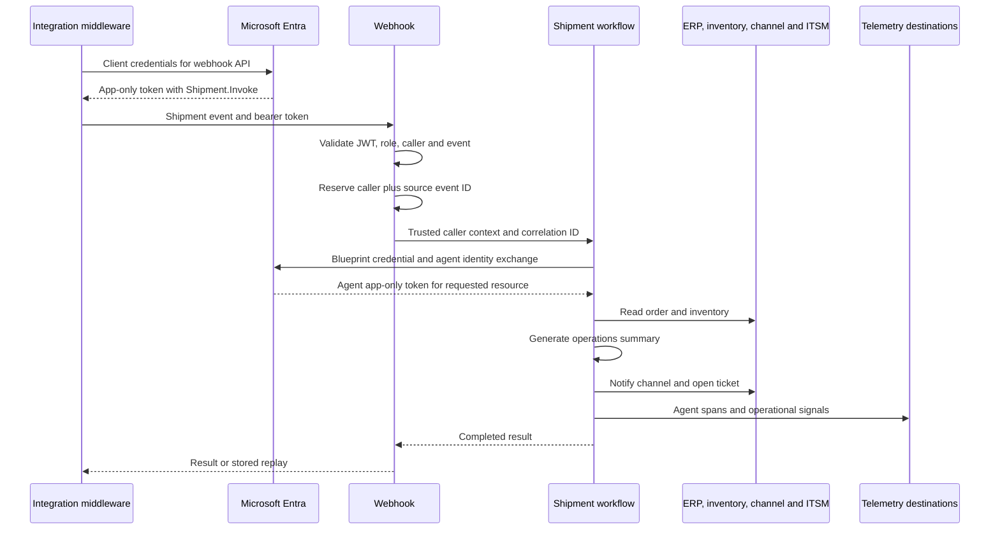

# Architecture: an event-driven S2S agent

We have two separate authorization decisions. The webhook decides whether the middleware may submit work, and each downstream resource decides whether the agent may perform its operation. A successful first decision doesn't grant permission for the second.

## Request and execution flow



The diagram shows the onboarded path. In the starting point, a local signing key can replace Entra at ingress, and all four downstream systems are in-process stubs. We add the blueprint exchange and telemetry export through the runbook. Azure OpenAI reasoning is available independently of Agent 365 registration.

The .NET host uses ASP.NET Core and Agent Framework; Python uses FastAPI and LangChain; Node.js uses Express, TypeScript and LangChain. These are implementations of the same flow, not different identity paths. Each listens on port `5168` by default, so we run one stack at a time unless we change its port.

## Identity inventory

| Identity or identifier | Purpose | Where we use it |
| --- | --- | --- |
| Middleware application and service principal | Authenticates the caller | Inbound token `azp`; `Ingress:AllowedCallers`; app-role assignment |
| Webhook API application and service principal | Owns the inbound API permission | `Ingress:Audience`; `Shipment.Invoke` role definition |
| Agent identity blueprint | Holds credentials and defines the agent identity family | First outbound token exchange; blueprint attribution |
| Agent identity client ID, also called app ID | Identifies the acting agent application | `fmi_path`, second exchange `client_id`, `gen_ai.agent.id`, export route |
| Agent identity directory object ID | Identifies the child service principal object | Permission grants and the custom `s2s.agent.object_id` attribute |
| Optional managed identity | Provides a secretless credential for the blueprint | Federated identity credential trust |

The table uses .NET configuration names. Python and Node.js use `INGRESS_ALLOWED_CALLERS` and `INGRESS_AUDIENCE` for the same settings. Phase 1 of the [skill-led](3.Runbook.md#phase-1-protect-the-webhook-with-entra) and [manual](3.Runbook-Manual.md#phase-1-protect-the-webhook-with-entra) guides shows both formats.

The webhook API is a standard app registration, not another Agent 365 agent. This separation lets us configure inbound app roles without assuming that every property of a conventional API registration can be set on a child agent identity.

The [Agent 365 identity model](https://learn.microsoft.com/microsoft-agent-365/developer/identity) assigns credentials to the blueprint and permissions to the child identity. A managed identity can authenticate the blueprint; it does not replace the child identity that performs the operation.

S2S, OBO and Agentic-User describe execution context, not a fixed number of directory objects. S2S has no signed-in user; OBO uses a human user's delegated context; Agentic-User uses the agent's own user account. An AI teammate can also have a background S2S workload, so Teams hosting alone doesn't determine the OAuth flow.

## The two outbound exchanges

For a blueprint-derived agent, a direct client-credentials request using the blueprint ID against the final resource is the wrong token flow. We first obtain an exchange assertion for a particular child, then use that assertion to authenticate the child.

```text
POST https://login.microsoftonline.com/{tenant-id}/oauth2/v2.0/token
Content-Type: application/x-www-form-urlencoded

client_id={blueprint-client-id}
grant_type=client_credentials
scope=api://AzureADTokenExchange/.default
fmi_path={agent-identity-client-id}
client_secret={blueprint-secret-for-local-development}
```

This returns the intermediate token T1. The secret shown here is a development credential held outside source control. In a hosted application, the blueprint can use a federated managed identity assertion or a certificate instead. Obtaining a managed identity assertion adds a credential-acquisition step before these two exchanges.

```text
POST https://login.microsoftonline.com/{tenant-id}/oauth2/v2.0/token
Content-Type: application/x-www-form-urlencoded

client_id={agent-identity-client-id}
grant_type=client_credentials
client_assertion_type=urn:ietf:params:oauth:client-assertion-type:jwt-bearer
client_assertion={T1}
scope={resource}/.default
```

This returns an app-only access token for one resource. We don't send T1 to the ERP API, and neither request uses the middleware's bearer token. The [autonomous app OAuth protocol](https://learn.microsoft.com/entra/agent-id/agent-autonomous-app-oauth-flow) describes the managed identity variant and recommends the supported authentication SDKs over a hand-written protocol client.

For the Agent 365 export recipe, the current [authentication guide](https://learn.microsoft.com/microsoft-agent-365/developer/observability-authentication-setup#agent-365-enabled-using-s2s) uses `api://9b975845-388f-4429-889e-eab1ef63949c/.default`. The final token needs the application role `Agent365.Observability.OtelWrite`. We keep this scope configurable and don't substitute a Bot Framework or Power Platform audience from another sample.

```text
final token azp/appid
    = agent identity client ID
    = gen_ai.agent.id
    = agent ID in /observabilityService/tenants/{tenantId}/otlp/agents/{agentId}/traces
```

All four values identify the same application. The blueprint client ID, the webhook API client ID and the agent identity directory object ID are different values.

## What we trust at ingress

Each host validates the bearer token's signature, issuer, audience and lifetime. Entra mode accepts tenant-specific v2 tokens signed with RS256. Local mode accepts HS256 tokens from a local issuer and is restricted to Development and loopback connections.

After validation, our policy requires `idtyp=app`, the configured `roles` value, a matching `tid`, and an allowed caller client ID. Tokens carrying `scp`, `upn`, `preferred_username`, or `unique_name` are rejected. We don't reject `oid`: an app-only token can use it to identify the calling service principal.

The caller's display name comes from our configured allowlist. We don't trust a display-name header or a name copied out of an unvalidated token. Rejections before successful token validation record the caller as `unknown`; reporting an attacker-supplied client ID as verified attribution would give us a misleading audit trail.

This authentication authorizes the calling application and gives us trusted service attribution. The agent still executes under its own identity. If a person triggered the middleware upstream, the app-only token doesn't establish who that person was or delegate their permissions; acting within a signed-in person's permissions is the OBO path.

Correlation IDs are caller-supplied labels, not credentials. We accept one `X-Correlation-ID` containing at most 64 ASCII letters, digits, periods, underscores or hyphens, or generate a GUID when it is absent. We don't accept caller-provided agent IDs or original-initiator headers. A future agent-to-agent variant would need a separately validated delegation contract.

## Retries and partial failure

The event ledger uses `(verified caller client ID, source event ID)` as its key, with a payload comparison. This separates callers' event namespaces without allowing a retry from the same caller to alter the order or delay.

| Existing state | HTTP result | Effect |
| --- | --- | --- |
| None | `200` after completion | Reserve once and run |
| Completed, same payload | `200`, `replayed=true` | Return the original result without invoking tools |
| Same key, different payload | `409`, `payload_conflict` | Reject the replacement |
| In progress | `409`, `in_progress` | Caller can retry later with the same event |
| Failed | `409`, `failed` | Reconcile possible partial effects before retrying work |
| Capacity reached | `503`, `capacity_reached` | Refuse new events; existing replays remain available |

An initial execution failure returns `500`. We retain its failed reservation because a channel notification could have succeeded before ticket creation failed. The ledger has no automatic expiry or eviction, and defaults to 10,000 entries; restarting clears it.

All three implementations reserve the event before awaiting the workflow. We run a single process, including one Uvicorn worker in Python; multiple workers would have separate ledgers and could each execute the same event.

For deployment we need a durable reservation, a payload fingerprint, recorded operation outcomes, and an idempotency key honored by each downstream writer. A distributed lock alone doesn't undo a notification that was sent before a crash.

## Telemetry boundaries

An accepted new event becomes one `invoke_agent` operation. The four tool spans are its children, and a real model invocation contributes a `chat` span. Stub reasoning must not masquerade as a model call. Duplicate requests and authorization failures remain ingress attempts, not new successful agent runs.

Agent 365 receives the agent traces. The runbook also offers an optional application-specific extension for volume metrics and audit attributes. Those metrics and structured rejection logs go to our operational destination, including attempts that never reached the agent. We use console output first; an OTLP collector can receive these signals when we have a backend. We don't assume that Agent 365's trace endpoint stores custom metrics or that every custom field becomes a column in the admin center.

## Wrapping up

Both the [skill-led](3.Runbook.md) and [manual](3.Runbook-Manual.md) runbooks create the inbound registrations first, then the blueprint-derived identity and its S2S exporter. That order establishes the caller's authorization boundary before we grant the agent permission to act.
