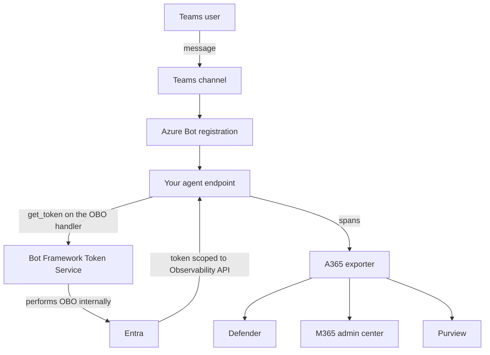

# Teams Agent — Custom Engine OBO — Overview

## Scenario Overview

**Scenario Type**: Onboarding an existing Teams-hosted agent into Microsoft Agent 365
**Agent Type**: Interactive (user-driven, conversational)
**Onboarding Path**: Custom engine agent using on-behalf-of
**Primary Tools**: Agent 365 Skills, Agent 365 CLI, Azure Bot Service, Microsoft Entra ID, OpenTelemetry
**Stacks**: .NET Agent Framework · Python + LangChain
**Complexity**: Intermediate
**Status**: 🚧 In progress

## Problem Statement

Your agent already lives where your users do — in Microsoft Teams, or surfaced through Microsoft
365 Copilot. People chat with it. It answers.

But it's a **custom engine agent**: you own the model, the orchestration, and the bot registration
behind it. The Teams channel routes messages to your endpoint, and everything after that is your
code. Which means everything after that is also invisible to your organisation:

- **No security visibility.** Nothing in Defender, so a prompt-injection attempt through Teams
  leaves no trace anyone can hunt.
- **No governed identity.** The bot registration is an app registration, not an agent your tenant
  can inventory and reason about.
- **No attribution.** Nobody can answer "who in Teams used this agent, and what did it do for
  them?"
- **Compliance can't see it.** Purview sees the Teams conversation, not what the agent actually
  did.

Onboarding to Agent 365 closes that gap without changing what your users experience.

## Solution Summary

You start from a working, un-instrumented Teams agent and end with the same agent, behaving
identically, but registered and observable.

The interesting part is the **token**, and it is far simpler than you might expect.

### Key Capabilities

| Capability | What it means here |
| --- | --- |
| Agent identity | The agent is registered in your tenant, alongside the bot that hosts it |
| User attribution | Every turn is attributed to the Teams user who sent the message |
| Telemetry | `invoke_agent`, `chat` and `execute_tool` spans, with prompts and tool arguments |
| Teams SSO | The user signs in once, silently, and the same token chain feeds observability |

### How It Works

## What makes this scenario different

A [web app using user OBO](../Web-App-Agent-User-OBO/) has to build a two-hop token exchange by
hand. **Here you do not.**

An Azure Bot OAuth connection can be configured with the Agent 365 Observability scope directly.
When your agent asks for a token on that connection, the **Bot Framework Token Service performs
the on-behalf-of exchange itself** and hands back a finished token. No MSAL, no `fmi_path`, no
blueprint secret in your code.

The work moves out of your code and into **configuring the OAuth connection correctly**. That
trade is a good one, but it means the failure modes are different: when this scenario breaks, it
usually breaks in Azure Bot Service configuration, not in C# or Python.

### The counterintuitive part

For a custom engine agent, the id in `gen_ai.agent.id` is the **bot app registration's client
id** — *not* the Agent 365 agent identity.

That surprises most people, and it's worth understanding early. These turns carry **no agentic
identity** (in the reference agents, `agenticAppId` and `agenticUserId` are both absent on the
activity), so the agent has no credential with which to make itself the token's `azp`. The export
route only authorises when the token's `azp` matches the id in the URL — so the URL has to name
the bot app.

This was confirmed empirically against the live service with one token and three candidate ids:

| Id used in the export URL | Result |
| --- | --- |
| Agent 365 agent identity | `403` |
| Agent blueprint | `403` |
| **Bot app registration** | `415` — authorised, wrong content type for the probe |

`403` means "not authorised". `415` means "authorised, and your probe was malformed" — which is
the *pass* here.

## Why this path and not another

Because a **human is chatting with the agent in Teams**, and your bot registration owns the
conversation.

- If your agent is a **web app** with its own sign-in, use
  [Web App Agent — User OBO](../Web-App-Agent-User-OBO/).
- If your agent should act **under its own identity**, with its own mailbox and presence, use
  [AI Teammate — Agent Identity](../AI-Teammate-Agent-Identity/).

## Business Outcomes

| Outcome | Why it matters |
| --- | --- |
| 🔍 **Visibility** | Teams agent activity is huntable in Defender |
| 👤 **Attribution** | Activity ties back to the Teams user who asked |
| 🛡️ **Governance** | The agent is inventoried in the Microsoft 365 admin center |
| 📊 **Compliance** | Purview sees agent content, not just the chat transcript |
| 🔑 **Single sign-on** | One Teams SSO token feeds both the agent and observability |

## In Scope / Out of Scope

### ✅ In Scope

- Registering a custom engine agent with the Agent 365 CLI
- Configuring the Azure Bot OAuth connection that mints the observability token
- Wiring OpenTelemetry and the Agent 365 exporter
- Getting `gen_ai.agent.id` right for a custom engine agent
- Emitting the required semantic spans, attributed to the Teams user
- Verifying telemetry in Defender and the admin center

### ❌ Out of Scope

- Building the agent, the bot registration, or the Teams app package
- Publishing to the Teams store
- Autonomous agents acting without a user
- Production hosting, scaling and CI/CD

## Target Users

| Persona | Role in this scenario |
| --- | --- |
| **Agent developer** | Runs the runbook; owns the code and the bot configuration |
| **Azure administrator** | Owns the Azure Bot resource and its OAuth connections |
| **Entra / tenant admin** | Grants admin consent |
| **Security analyst** | Consumes the telemetry in Defender |

## Starting point

| Stack | Path |
| --- | --- |
| .NET Agent Framework | [`0.Resources/Starting-point/dotnet/`](0.Resources/Starting-point/dotnet/) |
| Python + LangChain | [`0.Resources/Starting-point/python/`](0.Resources/Starting-point/python/) |

Both are Microsoft Learn research assistants, reachable in Teams, grounded in the official
[Microsoft Learn MCP server](https://learn.microsoft.com/api/mcp). Neither contains any Agent 365
code.

> **The .NET starting point is reconstructed, not a snapshot.** In the reference repo, Agent 365
> was added to this agent *before* the bot channel ever worked end to end, so no commit exists
> that is both working and Agent 365-free. The starting point here is the pre-onboarding state
> plus the two unrelated fixes needed to make it run. It builds clean and packages for Teams.

## Related Resources

| Resource | Link |
| --- | --- |
| Architecture and token flow | [2.Architecture.md](2.Architecture.md) |
| The step-by-step runbook | [3.Runbook.md](3.Runbook.md) |
| Sample prompts | [4.Sample-prompts.md](4.Sample-prompts.md) |
| Observability authentication setup | https://learn.microsoft.com/microsoft-agent-365/developer/observability-authentication-setup |
| Observability concepts | https://learn.microsoft.com/microsoft-agent-365/developer/observability-concepts |
| Finished .NET reference agent | https://github.com/qmatteoq/agent365-demos/tree/main/dotnet-agent-teams |
| Finished Python reference agent | https://github.com/qmatteoq/agent365-demos/tree/main/python-agent-teams |
