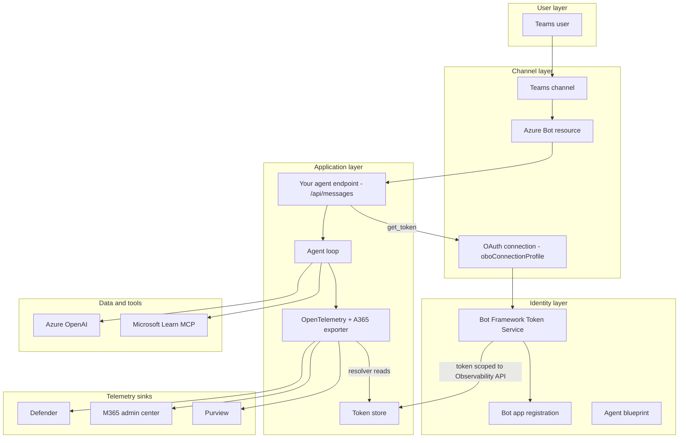
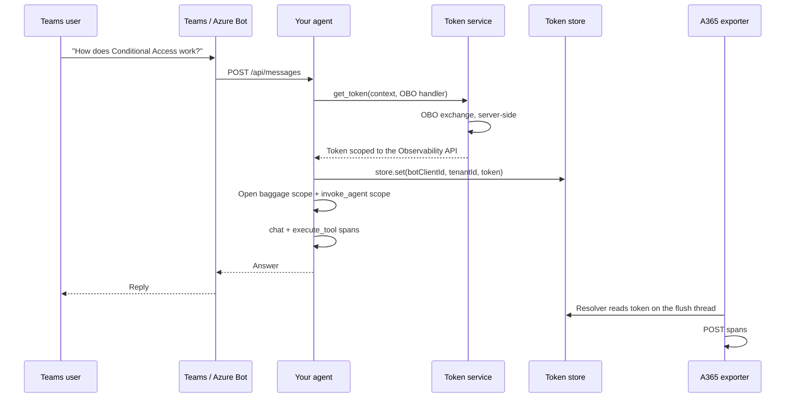
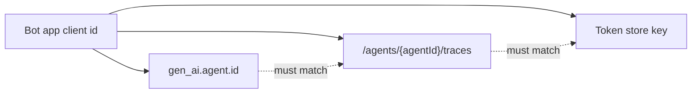

# Teams Agent — Custom Engine OBO — Architecture

## 1. Logical Architecture



## 2. Key Components

| Component | Technology | Role |
| --- | --- | --- |
| Azure Bot resource | Azure Bot Service | Routes Teams messages to your endpoint; hosts OAuth connections |
| Bot app registration | Entra app | The bot's identity — **and the observability agent id** |
| `oboConnectionProfile` | Azure Bot OAuth connection | Mints the observability token via OBO, server-side |
| Bot Framework Token Service | Azure | Performs the on-behalf-of exchange for you |
| Agent blueprint | Entra agentic app | Registers the agent in the tenant; holds permissions |
| Your endpoint | ASP.NET Core / aiohttp | Receives activities, runs the turn |
| A365 exporter | `Microsoft.OpenTelemetry` / `microsoft-opentelemetry` | Ships spans |

### Identities, and which one goes where

This is where the scenario is most often got wrong, so it's worth a table of its own.

| Identity | Created by | Its job | Goes in `gen_ai.agent.id`? |
| --- | --- | --- | --- |
| **Bot app registration** | You / Azure Bot | Signs Bot Framework replies; owns the OAuth connection | ✅ **Yes** |
| **Agent blueprint** | `a365 setup all` | Tenant registration and permissions | ❌ No — goes in `agent_blueprint_id` |
| **Agent identity** | `a365 setup all` | Used by agentic paths | ❌ No — unused on this path |

> **Bot app and blueprint must remain separate identities.** A blueprint is an *agentic*
> application, and Entra refuses to issue it client-credentials tokens (`AADSTS82001`). It
> therefore can never sign Bot Framework replies. It is also the wrong audience for validating the
> inbound Teams token. Do not attempt to consolidate them.

## 3. Data Flow

### Scenario A — One Teams turn



### Scenario B — Why there's no token chain in your code

The whole exchange is one call:

```python
token_response = await AUTHORIZATION.get_token(context, OBO_AUTH_HANDLER)
```

What makes that sufficient is the **connection configuration**, not the code. The OAuth connection
is created with the Agent 365 Observability scope:

```bash
az bot authsetting create -g <resource-group> -n <azure-bot-name> \
  -c oboConnectionProfile \
  --client-id <bot-app-client-id> --client-secret <bot-app-secret> \
  --service AadV2 \
  --provider-scope-string \
    "api://9b975845-388f-4429-889e-eab1ef63949c/Agent365.Observability.OtelWrite" \
  --parameters tenantID=<tenant-id> tokenExchangeUrl=api://botid-<bot-app-client-id>
```

Three details in that command carry the whole scenario:

| Detail | Why it matters |
| --- | --- |
| A **named** scope, not `/.default` | A delegated token carries *scopes*, not roles. Leaving the default `api://botid-…/defaultScopes` produces `401 InvalidAudience` |
| `tokenExchangeUrl` | Keeps Teams SSO silent — the manifest declares one `webApplicationInfo.resource`, and the connection exchanges that single SSO token for its own |
| `--client-id` is the **bot app** | The resulting token's `azp` is the bot app, which is what the export route requires |

> The observability resource id `9b975845-…` and the `Agent365.Observability.OtelWrite` scope are
> preview-era Agent 365 values. Re-verify them against current documentation before using them.

### Scenario C — The export URL and the id that authorises it

The exporter reads `gen_ai.agent.id` off the span and builds:

```text
POST /observability/tenants/{tenant}/otlp/agents/{agentId}/traces
```

It then looks the token up in your token store **under the same value**. So three things must be
identical:

```text
gen_ai.agent.id  ==  the token's azp  ==  the token store key
```

For a custom engine agent, all three are the **bot app registration's client id**. A mismatch is
`HTTP 403`.



### Scenario D — Why baggage and the invoke scope must agree

Auto-instrumented spans — the LangChain call, the LLM call — take `gen_ai.agent.id` from
**baggage**, not from the invoke scope. The exporter partitions spans by that attribute.

If the baggage agent id and the `AgentDetails` agent id disagree, the turn splits into **two
identity groups**, and only one of them has a token. Half the turn exports; half is silently
dropped.

Set both from the same source value. In the reference agents that is a single
`observability_agent_id` property, used in both places precisely so they cannot drift.

## 4. What the telemetry has to contain

| Requirement | Consequence if missing |
| --- | --- |
| A root `invoke_agent` span | Nothing appears in the M365 admin center |
| `gen_ai.operation.name` in `{invoke_agent, chat, execute_tool, output_messages}` | That span is dropped individually |
| An active baggage scope around the turn | `Partitioned into 0 identity groups` — everything dropped |
| Baggage agent id == `AgentDetails` agent id | Turn splits into two groups; half is dropped |
| `channel_name` = `msteams` | Activity is not attributed to the Teams channel |
| Caller identity from the turn context | Admin center cannot resolve the user |
| Session, conversation and channel on the `Request` object | Span accepted, no run context shown |

### The asymmetry that explains most failures

| Sink | Ingests |
| --- | --- |
| Microsoft Defender (`CloudAppEvents`) | Every operation |
| Microsoft 365 admin center | **`invoke_agent` rows only**, and reads the caller off that span |

**Activity in Defender but not the admin center points at your `invoke_agent` span, not your
export plumbing.** Source:
[observability concepts](https://learn.microsoft.com/microsoft-agent-365/developer/observability-concepts#where-your-data-shows-up).

And `HTTP 200` with an empty `partialSuccess` is **not** proof of ingestion — it can still be
dropped downstream, for example when no user in the tenant holds an Agent 365 licence.

## 5. Security & Governance Considerations

| Area | Consideration |
| --- | --- |
| Bot secret | Held by the Azure Bot OAuth connection and your app config. Never in source control |
| ⚠️ **`a365 setup all` overwrites bot credentials** | It rewrites the bot channel credentials in your config with the blueprint's, replacing the secret **in place** so the original is unrecoverable. See the runbook — back them up first |
| Silent breakage | That overwrite fails silently: the running process keeps the old values in memory and only breaks on the next restart |
| Least privilege | Delegated scope only — the agent can do what the Teams user could do |
| Sensitive data | `enable_sensitive_data` records prompts and tool arguments. Usually desirable for Defender; understand what you're recording |
| Dev tunnels | A tunnel URL exposes your local machine to the internet while running. Its URL is **not** derived from the tunnel name — read it from the host output, never guess it |

## Related Resources

| Resource | Link |
| --- | --- |
| Scenario overview | [1.Overview.md](1.Overview.md) |
| The step-by-step runbook | [3.Runbook.md](3.Runbook.md) |
| Observability authentication setup | https://learn.microsoft.com/microsoft-agent-365/developer/observability-authentication-setup |
| Observability concepts | https://learn.microsoft.com/microsoft-agent-365/developer/observability-concepts |
