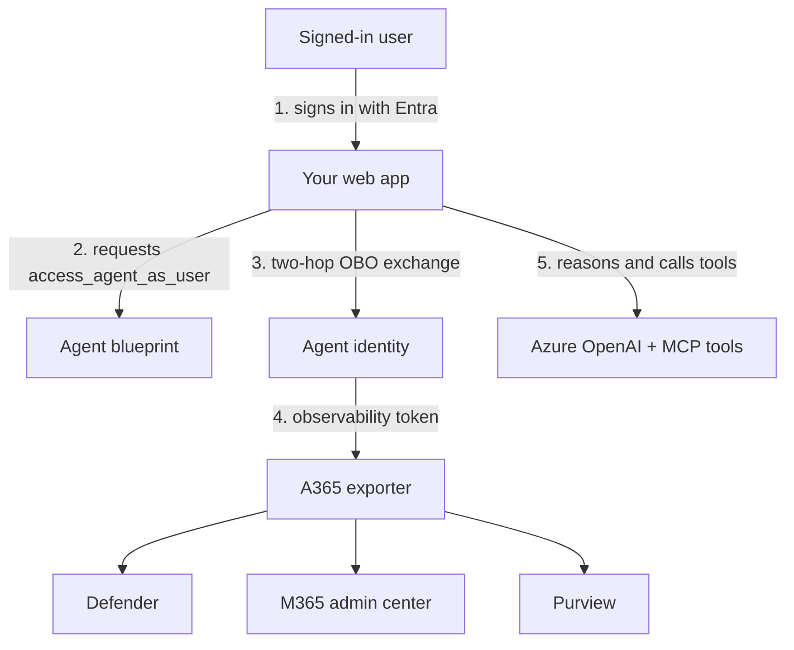

# Web App Agent: User OBO, Overview

## Scenario Overview

**Scenario Type**: Onboarding an existing web-hosted agent into Agent 365
**Agent Type**: Interactive (user-driven)
**Onboarding Path**: User on-behalf-of (OBO)
**Primary Tools**: Agent 365 CLI, Microsoft Entra ID, OpenTelemetry; optional skills and Work IQ
**Stacks**: .NET Agent Framework (Blazor Server) · Python + LangChain (FastAPI) · Node.js + LangChain (Express)
**Complexity**: Intermediate
**Runbooks**: [Skill-led](3.Runbook.md) and [manual](3.Runbook-Manual.md)

We can follow either route with our own web agent. The manual guide requires no coding assistant,
and the supplied research assistants are optional educational examples.

## Problem Statement

You have an agent that works. A user opens a page, asks a question, the agent reasons, calls its
tools, and answers. It runs on your laptop or in your app service and nobody outside your team
knows it exists.

That is the problem. From the enterprise's point of view the agent is invisible:

- **Security has no record of it.** Nothing shows up in Microsoft Defender. If the agent leaks
  data or is prompt-injected, there is no trail.
- **It has no identity.** It isn't an object in your tenant, so it can't be governed, assigned
  permissions, or audited like any other principal.
- **Nobody knows who used it, or what it did.** No admin can answer "which of my users ran this
  agent last week, and what did it look at?"
- **It can't safely touch Microsoft 365 data.** Reaching Mail or Calendar means hand-rolling
  Graph permissions and hoping the delegation is right.

We register and instrument a user-driven web app so its activity can be attributed to the person
who signed in. Microsoft 365 data access is a separate integration: the manual guide covers Work IQ
selection and consent, then explains the runtime work still needed.

## Solution Summary

You start from a working, un-instrumented agent. You end with the same agent, still behaving
identically to its users, but now:

- registered in your tenant as an **agent blueprint** with its own **agent identity**
- emitting telemetry to **Microsoft Defender**, **Microsoft Purview** and the
  **Microsoft 365 admin center**, attributed to the user who asked
- optionally able to read and act on **Microsoft 365 data** through Work IQ MCP servers

### Key Capabilities

| Capability | What it means here |
| --- | --- |
| Agent identity | The agent is a real principal in Entra, distinct from the web app that hosts it |
| User attribution | Every action is recorded against the signed-in user who caused it, by directory object id |
| Telemetry | `invoke_agent`, `chat` and `execute_tool` spans, with prompts and tool arguments |
| Microsoft 365 data | Mail, Calendar and more, reached with the user's own permissions |

### How It Works

The user signs in to **your web app**, not to the agent. The app then exchanges that user's token
through a two-hop chain so the *agent identity* can act on behalf of that user. That chain is
the heart of this scenario, and [2.Architecture.md](2.Architecture.md) walks through it.

## Why "user OBO" and not something else

Because a human is present and driving. The agent has no business doing anything the signed-in
user could not do themselves, and every action should be attributed to that person.

For scheduled or event-driven work using application permissions, choose
[Service-to-service](../Service-to-Service-Agent/1.Overview.md). If the agent needs its own user
account, mailbox and Microsoft 365 presence, choose
[AI Teammate / Autopilot](../AI-Teammate-Agent-Identity/1.Overview.md). For interactive delegated
work through our own Teams bot, choose
[Teams: Custom engine OBO](../Teams-Agent-Custom-Engine-OBO/1.Overview.md).

## Business Outcomes

| Outcome | Why it matters |
| --- | --- |
| 🔍 **Visibility** | Security can hunt agent activity in Defender alongside every other signal |
| 👤 **Attribution** | Admins can answer "who ran this, and what did it do" from the admin center |
| 🛡️ **Governance** | The agent is a governed principal, not an anonymous process holding secrets |
| 📊 **Compliance** | Purview sees agent content the same way it sees other Microsoft 365 content |
| 🔌 **Data access** | Microsoft 365 data through a supported, permissioned path |

## In Scope / Out of Scope

### ✅ In Scope

- Registering an agent blueprint and agent identity with the Agent 365 CLI
- Registering the Entra sign-in app and wiring it to the blueprint, so the user assertion the OBO chain needs actually has the right audience
- Wiring OpenTelemetry and the Agent 365 exporter
- The two-hop agent on-behalf-of token chain
- Emitting the semantic spans Agent 365 requires
- Attributing activity to the signed-in user correctly
- Selecting Work IQ MCP servers and completing consent; runtime integration is a separate step
- Verifying telemetry actually arrives, in both Defender and the admin center

### ❌ Out of Scope

- Building the agent itself, you bring one, or use the starting point provided
- Hosting the agent in Teams or Microsoft 365 Copilot
- Autonomous agents that act without a signed-in user
- Production deployment, scaling, and CI/CD
- Model choice, prompt engineering, and agent quality

## Target Users

| Persona | Role in this scenario |
| --- | --- |
| **Agent developer** | Runs the runbook; owns the code changes |
| **Entra / tenant admin** | Grants admin consent for the blueprint's permissions |
| **Security analyst** | Consumes the resulting telemetry in Defender |
| **Microsoft 365 admin** | Sees the agent and its activity in the admin center |

## Starting point

Three optional samples implement the same research workflow:

| Stack | Path | Hosting |
| --- | --- | --- |
| .NET Agent Framework | [`0.Resources/Starting-point/dotnet/`](0.Resources/Starting-point/dotnet/) | Blazor Server |
| Python + LangChain | [`0.Resources/Starting-point/python/`](0.Resources/Starting-point/python/) | FastAPI |
| Node.js + LangChain | [`0.Resources/Starting-point/nodejs/`](0.Resources/Starting-point/nodejs/) | Express |

All three are Microsoft Learn research assistants: they answer questions about Microsoft products by
searching the official [Microsoft Learn MCP server](https://learn.microsoft.com/api/mcp) and
citing what they retrieved. None of them contains a single line of Agent 365 observability code. All
three do ship the Microsoft Entra sign-in the OBO path depends on, but it stays
dormant until the settings are filled in, so you can run them anonymously before anything is
registered and then configure the sign-in in Phase 1, which is where the runbook covers it.

You can equally bring your own agent. The runbook calls out what it assumes about your code.

## Related Resources

| Resource | Link |
| --- | --- |
| Architecture and token flow | [2.Architecture.md](2.Architecture.md) |
| Skill-led runbook | [3.Runbook.md](3.Runbook.md) |
| Manual runbook, no coding assistant required | [3.Runbook-Manual.md](3.Runbook-Manual.md) |
| Prompts to exercise the finished agent | [4.Sample-prompts.md](4.Sample-prompts.md) |
| Agent on-behalf-of OAuth flow | https://learn.microsoft.com/entra/agent-id/agent-on-behalf-of-oauth-flow |
| Agent 365 observability concepts | https://learn.microsoft.com/microsoft-agent-365/developer/observability-concepts |
| Finished .NET reference agent | https://github.com/qmatteoq/agent365-demos/tree/main/dotnet-agent-no-teams |
| Finished Python reference agent | https://github.com/qmatteoq/agent365-demos/tree/main/python-agent-no-teams |

There is no finished Node.js agent in the demos repository yet. If that's your stack, the runbook is
the reference: it shows the Node.js version of every step alongside the other two.

## Wrapping up

Keep the user's delegated identity for this path, then follow either runbook through registration,
observability and verification. An app-only background operation belongs to the S2S path even if
the same application also serves signed-in users.
