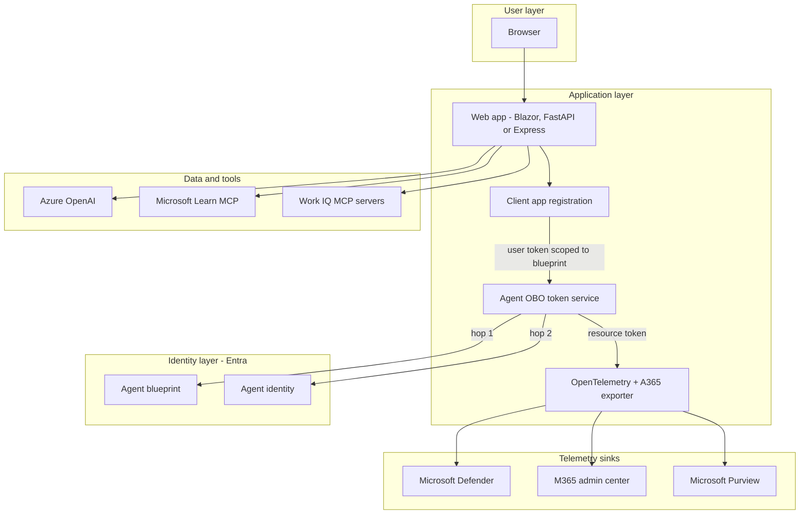
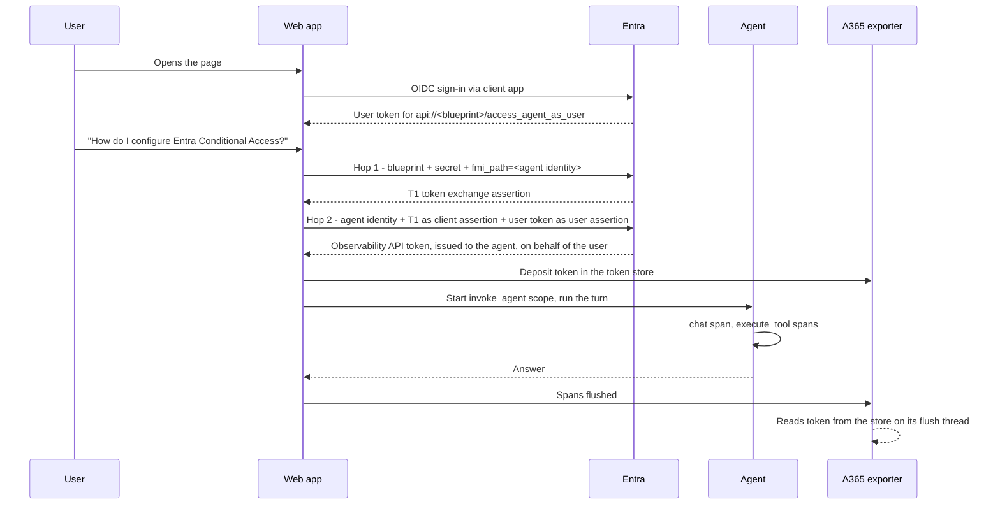
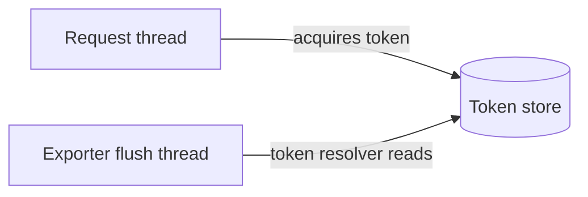

# Web App Agent: User OBO Architecture

This architecture applies to both the [skill-led](3.Runbook.md) and [manual](3.Runbook-Manual.md)
runbooks. The manual route implements the same user-delegated flow without a coding assistant.

## 1. Logical Architecture

Three layers. Notice that **two different identities** are involved on
the agent side, and conflating them is the most common way to break this scenario.



## 2. Key Components

| Component | Technology | Role |
| --- | --- | --- |
| Web app | Blazor Server, FastAPI or Express | Hosts the chat UI and the agent loop |
| Client app registration | Entra app | Signs the **user** in. This is not the agent. |
| Agent blueprint | Entra agentic app | The agent's parent registration; holds permissions and the client secret |
| Agent identity | Entra agent identity | The child principal that actually acts on behalf of the user |
| Agent OBO token service | Your code | Performs the two-hop exchange |
| A365 exporter | `Microsoft.OpenTelemetry`, `microsoft-opentelemetry` or `@microsoft/opentelemetry` | Ships spans to Agent 365 |
| Token store | Your code | Bridges the per-request token to the exporter's background flush thread |

### The three identities, and why they must stay separate

| Identity | Created by | What it does | What it must **not** do |
| --- | --- | --- | --- |
| **Client app** | You | Signs the user in interactively | Act as the agent |
| **Blueprint** | `a365 setup all` | Owns permissions; authenticates hop 1 | Run interactive sign-in flows |
| **Agent identity** | `a365 setup all` | Acts on behalf of the user | Hold its own credential |

A blueprint is an **agentic application**, and Entra bars agentic applications from interactive
`/authorize` flows. That is why a separate client app registration signs the user in. The web app
then asks for the scope `api://<blueprint-id>/access_agent_as_user`, so the user token it receives
is *addressed to the blueprint*, which is what makes it usable as the assertion in hop 2.

## 3. Data Flow

### Scenario A: A user asks a question



### Scenario B: The two-hop token exchange, in detail

This is the part worth understanding properly, because everything else depends on it.

**Hop 1: the blueprint asks for a token exchange assertion.**

```http
POST https://login.microsoftonline.com/<tenant>/oauth2/v2.0/token

grant_type=client_credentials
client_id=<blueprint app id>
client_secret=<blueprint secret>
scope=api://AzureADTokenExchange/.default
fmi_path=<agent identity app id>
```

The `fmi_path` parameter is what makes this an *agent* flow rather than an ordinary
client-credentials call. It says: "issue me an assertion I can use to act as this child identity."
The result, call it **T1**, is not usable against any resource. It is only a credential for
hop 2.

**Hop 2: the agent identity performs the on-behalf-of exchange.**

```http
POST https://login.microsoftonline.com/<tenant>/oauth2/v2.0/token

grant_type=urn:ietf:params:oauth:grant-type:jwt-bearer
client_id=<agent identity app id>
client_assertion_type=urn:ietf:params:oauth:client-assertion-type:jwt-bearer
client_assertion=<T1>
assertion=<the signed-in user's token>
requested_token_use=on_behalf_of
scope=<target resource scope>
```

Two assertions are in play and they do different jobs. The **client assertion** (T1) proves *which
agent* is asking. The **user assertion** proves *for whom*. The token that comes back is issued to
the agent identity and carries the user's context, which is exactly what "the agent acted on
behalf of this person" means.

Reference: [Agent on-behalf-of OAuth flow](https://learn.microsoft.com/entra/agent-id/agent-on-behalf-of-oauth-flow).

### Scenario C: Why a token store exists

The exporter batches spans and flushes them on a **background thread**, long after the HTTP request
that produced them has ended. That thread has no user, no request context, and no way to run an
OBO exchange.

So the flow is inverted: the request thread acquires the token and **deposits** it in a small
store, keyed by agent id and tenant id. The exporter is given a **token resolver** that reads from
that store when it flushes.



If you skip this and try to acquire the token inside the resolver, it will fail. There is no user
context to exchange.

## 4. What the telemetry has to contain

Wiring the exporter is not sufficient. Agent 365 drops spans that don't meet its expectations, and
it does so quietly.

| Requirement | Consequence if missing |
| --- | --- |
| A root `invoke_agent` span | Nothing appears in the M365 admin center at all |
| `gen_ai.operation.name` in `{invoke_agent, chat, execute_tool, output_messages}` | That span is dropped individually |
| An active **baggage scope** around the turn | Spans are "partitioned into 0 identity groups" and dropped |
| Caller identity as a **directory object id** | Export succeeds, but the admin center cannot resolve the user |
| Session, conversation and channel on the `Request` object | Span is accepted but shows no run context |

## 5. Security & Governance Considerations

| Area | Consideration |
| --- | --- |
| Blueprint secret | Lives in user-secrets or environment, **never** in `appsettings.json` or `.env` committed to git |
| Least privilege | The agent can only do what the signed-in user could do: delegation, not elevation |
| Sensitive data | `enable_sensitive_data` records prompts and tool arguments on spans. That is usually what you want for Defender, but understand what you are recording |
| Token caching | Cache both hops and refresh early; a token expiring mid-turn silently disables export |
| Consent | The blueprint's permissions need tenant admin consent. Plan for a handoff if you aren't Global Admin |

## Related Resources

| Resource | Link |
| --- | --- |
| Scenario overview | [1.Overview.md](1.Overview.md) |
| Skill-led runbook | [3.Runbook.md](3.Runbook.md) |
| Manual runbook | [3.Runbook-Manual.md](3.Runbook-Manual.md) |
| Agent on-behalf-of OAuth flow | https://learn.microsoft.com/entra/agent-id/agent-on-behalf-of-oauth-flow |
| Agent 365 observability concepts | https://learn.microsoft.com/microsoft-agent-365/developer/observability-concepts |
