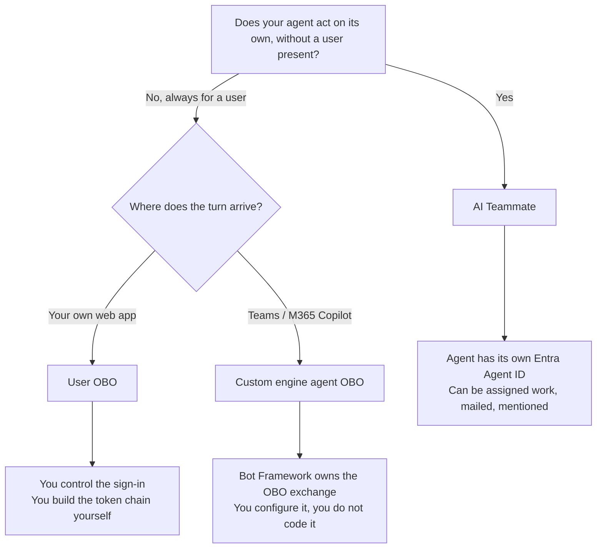

# Choosing Your Onboarding Path

Agent 365 onboarding is not one procedure with variations. There are three genuinely different paths, and the choice determines your token chain, your Entra registrations, and what the admin center can attribute your agent's activity to.

---

## The one question that decides it

> **Who is acting when your agent does something?**

| Answer | Path | Scenario |
| --- | --- | --- |
| A signed-in user, and the agent acts strictly on their behalf | **User OBO** | [Web App Agent](../01-scenarios/Web-App-Agent-User-OBO/) |
| A signed-in user, but the turn arrives through Teams / M365 Copilot | **Custom engine agent OBO** | [Teams Agent](../01-scenarios/Teams-Agent-Custom-Engine-OBO/) |
| The agent itself, as a principal with its own identity | **AI Teammate** | [AI Teammate](../01-scenarios/AI-Teammate-Agent-Identity/) |

---

## A decision flow

---

## What each path actually costs you

### Custom engine agent OBO: least code

You configure an Azure Bot OAuth connection and the Bot Framework Token Service performs the OBO exchange server-side. Your agent makes **one call** and receives a token.

**Choose it when** your agent lives in Teams or M365 Copilot and always acts for the user who messaged it.

### User OBO: most code, most control

You build the two-hop chain yourself. 

You also need **two Entra app registrations**: an ordinary one to sign the user in, and the agent blueprint. Entra bars agentic apps from interactive authorization flows, so the blueprint cannot sign users in.

**Choose it when** the agent is your own web app and you want the user's own permissions to bound what it can reach.

### AI Teammate: most capability, most moving parts

The agent becomes a principal. It gets an Entra Agent ID, can be assigned work, can receive mail, and appears in the admin center as an entity in its own right rather than as an action a user took.

The cost is that it is no longer a proxy. There is no delegated user authority capping what it can do, so its permissions have to be reasoned about directly. Onboarding also involves an **asynchronous approval step**: an administrator approves each instance, and that approval is not instantaneous.

**Choose it when** the agent does work that isn't a response to a user's message: scheduled runs, mail-triggered work, or anything where "which user asked for this?" has no sensible answer.

---

## False myths to dispel

**"We're a .NET shop, so we'll take the .NET path."** Stack and path are independent. Every
scenario ships the same agent in more than one language: .NET, Python and Node.js. The Agent 365 SDK supports all of them.

**"AI Teammate is the newest, so it must be the most advanced."** It's all about the role of the agent and its permissions. If you need an agent that should only ever act within a user's permissions, then the AI Teammate path isn't the right one.

**"We'll start with the simplest and migrate."** Migration is real work. The demo repo these runbooks are derived from migrated its Teams agents from a service-to-service chain to custom engine OBO, and it touched the token service, the configuration, the agent id and the export endpoint.

---

## How to tell you chose wrong

The symptoms are specific enough to be diagnostic.

| Symptom | Likely mismatch |
| --- | --- |
| `HTTP 403` from the observability endpoint | The agent id doesn't match the token's `azp`. Wrong path for your identity |
| `AADSTS82001` | You asked a blueprint for a client-credentials token; blueprints can't do that |
| Spans export cleanly, admin centre stays empty | The `invoke_agent` span is missing or its caller identity is unresolvable |
| `Partitioned into 2 identity groups` | Two different agent ids in one turn, usually a half-migrated path |
| `401 InvalidAudience` on a delegated token | The S2S route was used with a user token |

---

## Next

- [The Three Token Chains](The-Three-Token-Chains.md): what each path actually acquires
