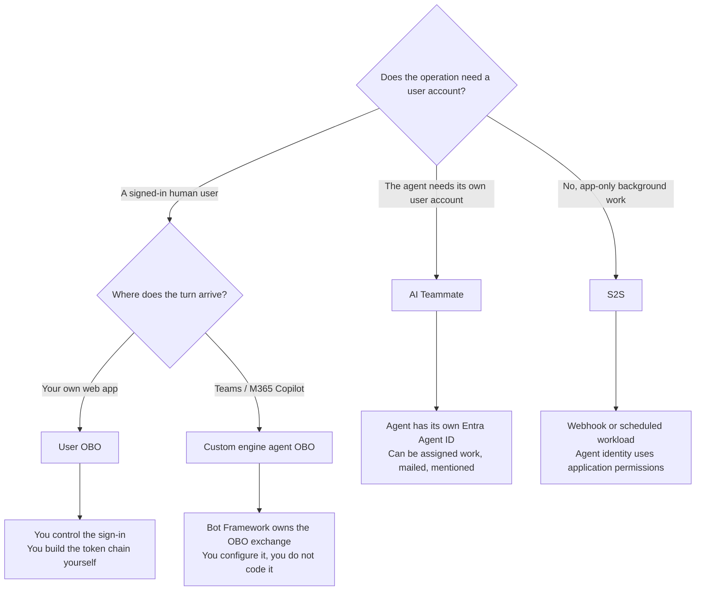

# Choosing Your Onboarding Path

The onboarding path determines the token chain, the Entra registrations, and what the admin center can attribute the agent's activity to. We need to distinguish the hosting model from the execution mode: a background webhook doesn't need an AI teammate's user account.

---

## The one question that decides it

> **Who is acting when your agent does something?**

| Answer | Path | Scenario |
| --- | --- | --- |
| A signed-in user, and the agent acts strictly on their behalf | **User OBO** | [Web App Agent](../01-scenarios/Web-App-Agent-User-OBO/) |
| A signed-in user, but the turn arrives through Teams / M365 Copilot | **Custom engine agent OBO** | [Teams Agent](../01-scenarios/Teams-Agent-Custom-Engine-OBO/) |
| An agent with its own user account, reached through Microsoft 365 | **AI Teammate** | [AI Teammate](../01-scenarios/AI-Teammate-Agent-Identity/) |
| A system event or machine caller, with no signed-in user | **Service-to-service (S2S)** | [S2S webhook agent](../01-scenarios/Service-to-Service-Agent/1.Overview.md) |

---

## A decision flow

We choose the flow for the operation being performed. An AI teammate can also have a background S2S workload; that doesn't make its user-context turns app-only.

---

## What each path actually costs you

### Custom engine agent OBO: least code

You configure an Azure Bot OAuth connection and the Bot Framework Token Service performs the OBO exchange server-side. Your agent makes **one call** and receives a token.

**Choose it when** your agent lives in Teams or M365 Copilot and always acts for the user who messaged it.

### User OBO: most code, most control

You build the two-hop chain yourself. 

You also need **two Entra app registrations**: an ordinary one to sign the user in, and the agent blueprint. Entra bars agentic apps from interactive authorization flows, so the blueprint cannot sign users in.

**Choose it when** the agent is your own web app and you want the user's own permissions to bound what it can reach.

### AI Teammate: most capability, most moving parts

The agent becomes a principal. It gets an Entra Agent ID, can be assigned work, can receive mail, and appears in the admin center as an entity in its own right rather than as an action a user took.

Its user-context operations are bounded by the permissions of the agent's own user account rather than a human caller's grants. Onboarding also involves an **asynchronous approval step**: an administrator approves each instance, and that approval is not instantaneous.

**Choose it when** the agent needs its own user account and Microsoft 365 presence, such as a mailbox or the ability to receive Teams messages. Background execution by itself doesn't require this hosting model.

### Service-to-service: machine-triggered, app-only work

The agent handles a webhook or scheduled task without a user token. A blueprint-derived identity uses an agentic client-credentials exchange to obtain resource tokens, and the observability exporter uses the S2S route.

The [supply-chain scenario](../01-scenarios/Service-to-Service-Agent/3.Runbook.md) separates the webhook API's caller permission from the agent's outbound permissions. Its .NET, Python and Node.js starting points have the same local stubs, app-only authorization and replay handling; the runbook adds Agent 365 identity and telemetry.

**Choose it when** middleware, a scheduler or another service initiates work that the agent must perform with application permissions.

---

## False myths to dispel

**"We're a .NET shop, so we'll take the .NET path."** Stack and path are independent. Every
scenario, including S2S, ships in .NET, Python and Node.js. We choose the identity path for
the operation, then use the implementation that matches our stack.

**"AI Teammate is the newest, so it must be the most advanced."** It's all about the role of the agent and its permissions. If you need an agent that should only ever act within a user's permissions, then the AI Teammate path isn't the right one.

**"We'll start with the simplest and migrate."** Migration is real work. The demo repo these runbooks are derived from migrated its Teams agents from a service-to-service chain to custom engine OBO, and it touched the token service, the configuration, the agent id and the export endpoint.

---

## How to tell you chose wrong

The symptoms are specific enough to be diagnostic.

| Symptom | Likely mismatch |
| --- | --- |
| `HTTP 403` from the observability endpoint | The agent id doesn't match the token's `azp`. Wrong path for your identity |
| `AADSTS82001` | The blueprint was used directly against the resource instead of exchanging through its child identity |
| Spans export cleanly, admin centre stays empty | The `invoke_agent` span is missing or its caller identity is unresolvable |
| `Partitioned into 2 identity groups` | Two different agent ids in one turn, usually a half-migrated path |
| `401 InvalidAudience` on a delegated token | The S2S route was used with a user token |

---

## Wrapping up

Once we've chosen the operation's identity context, [Token chains by onboarding path](The-Three-Token-Chains.md) explains which token to acquire and which identity to put on the exported spans.
