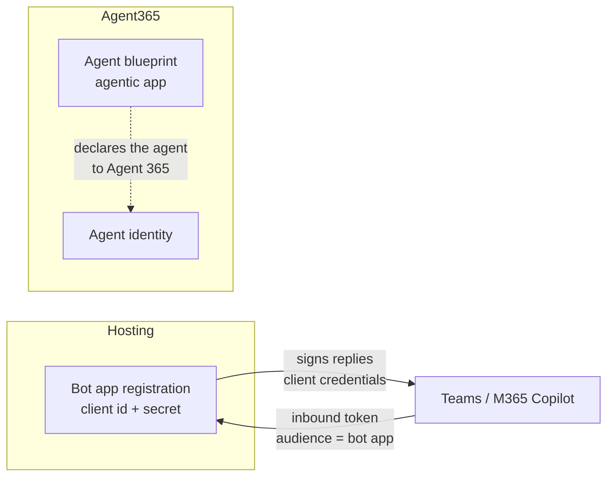

# Identity Separation

The single most common structural mistake in Agent 365 onboarding is trying to make one Entra
application do two jobs: host the agent *and* be the agent.

It looks like simplification. It is not possible, and the way it fails is slow.

---

## The rule

> The application that **hosts** your agent and the **agent blueprint** are different principals.
> They stay different.

Concretely, for a Teams agent that means the Azure Bot registration's Entra app and the Agent 365
blueprint are two separate app registrations with two separate client ids and two separate secrets.

---

## Why it cannot be collapsed

Not a convention or a recommendation. Two independent platform constraints, either of which is
sufficient on its own.

### 1. A blueprint cannot get a client-credentials token

Entra bars agentic applications from the client credentials grant. Asking for one produces:

```
AADSTS82001
```

The Bot Framework requires an application token to sign outbound replies. A blueprint can never
produce one, so **a blueprint can never be the identity that replies to Teams**. This isn't a
permissions problem you can grant your way out of.

### 2. It is the wrong audience anyway

The inbound token from Teams is addressed to the bot's app registration. Validating it against the
blueprint fails, because the blueprint is not who the token was issued for.

So even setting aside the grant restriction, the same identity cannot both receive the turn and be
the agent.

---

## The shape that works



The bot app handles the channel. The blueprint declares the agent. They meet in configuration, not
in a shared credential.

---

## The failure is silent, and delayed

This is what makes it dangerous rather than merely wrong.

`a365 setup all` **overwrites the bot channel credentials in your `.env` with the blueprint's**, and
replaces the bot secret in place. Two consequences:

1. **The original secret is unrecoverable.** It is not moved aside. It is overwritten. If you did
   not back it up, you regenerate it in the Azure portal.
2. **Nothing breaks immediately.** The running process already holds the old values in memory and
   keeps working. The failure appears at the *next restart*, which may be hours later and will not
   obviously connect to the command you ran.

### Before running `a365 setup all` on a Teams agent

Back up the file first:

```powershell
Copy-Item .env .env.backup-before-a365-setup
```

Then, after setup completes, restore the bot channel credentials, the ones under
`CONNECTIONS__SERVICE_CONNECTION__SETTINGS__` for Python, or `Connections:ServiceConnection` for
.NET. The blueprint values that `a365 setup all` wrote belong in the Agent 365 configuration, not
in the channel connection.

> Verify by restarting the agent and sending one message. In-memory state hides this bug; only a
> restart proves it.

---

## Which identity goes where

A quick reference for the Teams case, where the confusion is worst:

| Purpose | Identity |
| --- | --- |
| Validating the inbound Teams token | Bot app registration |
| Signing outbound Bot Framework replies | Bot app registration |
| `--client-id` on the Azure Bot OAuth connection | Bot app registration |
| `gen_ai.agent.id` in telemetry | Bot app registration |
| Declared to Agent 365 as the agent | Blueprint |
| `microsoft.a365.agent.blueprint.id` | Blueprint |

That `gen_ai.agent.id` is the bot app rather than the blueprint surprises people. The reasoning is
in [The Three Token Chains](The-Three-Token-Chains.md). The short version is that the agent id
must match the `azp` of the token you export with, and in this path that token is the bot app's.

---

## The same rule in the web app case

Different identities, same principle. A web app using user OBO needs an **ordinary** app
registration to sign the user in, because Entra bars agentic applications from interactive
`/authorize` flows too. The blueprint cannot present a sign-in page any more than it can request
client credentials.

So the web app also carries two registrations: one that signs users in, and the blueprint that the
user's token is addressed to via `api://<blueprint-id>/access_agent_as_user`.

---

## Related

- [Choosing Your Onboarding Path](Choosing-Your-Onboarding-Path.md)
- [The Three Token Chains](The-Three-Token-Chains.md)
