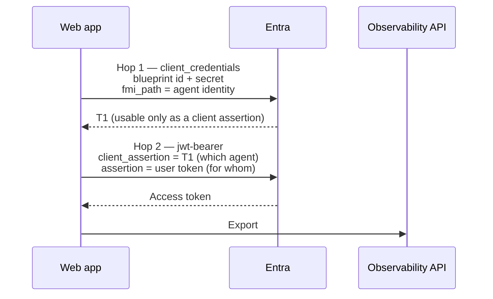

# Token chains by onboarding path

Each onboarding path acquires its observability token differently. This is the densest part of
Agent 365 onboarding and the part where a small mistake produces the most confusing symptom, so it
is worth understanding rather than copying.

The OBO and AI teammate sections describe the implementations used by the existing runbooks. The S2S
section follows the current Microsoft protocol documentation; that scenario ships
un-instrumented .NET, Python and Node.js starting points, so tenant token acquisition is part of its onboarding exercise.

---

## Why this matters more than it looks

Three values have to agree:

```
token azp  ==  gen_ai.agent.id  ==  the id in the export route
```

When they agree, telemetry lands. When they disagree, you get `HTTP 403`, or worse, a `200` and
nothing in the admin centre.

**Each path makes a different value correct.** That is the whole difficulty. There is no single
"the agent id" to reach for.

| Path | `gen_ai.agent.id` is… | Because |
| --- | --- | --- |
| User OBO | The **agent identity** app id | The chain makes the agent identity the acting principal |
| Custom engine OBO | The **bot app registration** client id | The turn carries no agentic identity, so the agent has no credential to make itself the `azp` |
| AI Teammate | The **agentic instance** id | Each installed teammate is a distinct instance; the blueprint rolls activity up |
| Service-to-service | The **agent identity app id** | The blueprint exchange authenticates the child using application permissions |

---

## Chain 1: User OBO (two hops, hand-rolled)

The agent proves *which agent it is* and *who it is acting for*, in one token.



**Hop 1**: the blueprint authenticates as itself and asks for an exchange assertion scoped to the
child agent identity:

```
grant_type   = client_credentials
client_id    = <blueprint id>
scope        = api://AzureADTokenExchange/.default
fmi_path     = <agent identity app id>
```

T1 is not an access token. It is only usable as a client assertion in hop 2.

**Hop 2**: the agent identity performs the OBO exchange:

```
grant_type            = urn:ietf:params:oauth:grant-type:jwt-bearer
client_id             = <agent identity app id>
client_assertion_type = urn:ietf:params:oauth:client-assertion-type:jwt-bearer
client_assertion      = T1
assertion             = <the signed-in user's token>
requested_token_use   = on_behalf_of
```

Both hops POST to `https://login.microsoftonline.com/{tenant}/oauth2/v2.0/token`.

### The two traps

**The user token must be addressed to the blueprint.** Request the scope
`api://<blueprint-id>/access_agent_as_user` when signing the user in. A token for any other
audience will not work as the assertion in hop 2.

**Read the caller's object id correctly.** In .NET, use `GetObjectId()` from
`Microsoft.Identity.Web`, *not* `FindFirst("oid")`. The OIDC handler renames inbound claims, so
`oid` misses, falls through to `ClaimTypes.NameIdentifier`, and yields the pairwise `sub` hash,
which the admin centre cannot resolve to a user. Export succeeds; attribution is blank. This is
the most common cause of "telemetry works but the admin centre shows nothing".

> **A note on MSAL.** Hop 1 does not always need to be hand-rolled. MSAL Python supports
> `fmi_path` natively on `acquire_token_for_client` (verified on MSAL 1.37), and `@azure/msal-node`
> version 5 has both halves, `fmiPath` on the client-credential request and
> `acquireTokenOnBehalfOf` for hop 2. The raw form posts above work everywhere and are what the
> runbooks show, because they match what you would write in any language.

---

## Chain 2: Custom engine OBO (one call, configured not coded)

There is no chain in your code. One call:

```python
await AUTHORIZATION.get_token(context, OBO_AUTH_HANDLER)
```

The Bot Framework Token Service performs the OBO exchange server-side, because the Azure Bot OAuth
connection is scoped to the Observability API. The work lives in `az bot authsetting create`.

Three details in that command are load-bearing:

| Detail | Why |
| --- | --- |
| A **named** scope, e.g. `.../Agent365.Observability.OtelWrite` | `/.default` yields `401 InvalidAudience`: delegated tokens carry scopes, not roles |
| `tokenExchangeUrl = api://botid-<bot-app-client-id>` | Keeps Teams SSO silent |
| `--client-id` = the **bot app** | This is what makes the resulting `azp` the bot app |

### Why the agent id is the bot app

Because the token's `azp` is the bot app, and the agent id must match it. A Teams turn carries no
agentic identity, so the agent has no credential with which to make itself the `azp`.

This was established empirically rather than assumed. One token, tried against three ids:

| Id used in the export route | Result |
| --- | --- |
| Agent identity | `403` |
| Blueprint | `403` |
| **Bot app** | **`415`** |

`415` is the pass: authorised, wrong content type for the probe. Authorisation had already
succeeded, which is what the probe was testing.

### Do not use the S2S endpoint here

Set it off explicitly (`a365_use_s2s_endpoint=False` / `UseS2SEndpoint = false`). The
service-to-service route takes application tokens only and refuses a delegated one.

---

## Chain 3: AI Teammate (deferred, not fetched)

The teammate does not acquire a token up front. It registers *the means* to acquire one:

```csharp
RegisterObservability(
    agentId,
    tenantId,
    new AgenticTokenStruct(userAuthorization, turnContext, authHandlerName),
    EnvironmentUtils.GetObservabilityAuthenticationScope());
```

The cache resolves it lazily when the exporter asks. This matters because the correct token depends
on the turn, and the turn isn't always agentic.

### Not every turn is agentic

```csharp
if (Activity.IsAgenticRequest()) { /* agentic handler → GetAgenticInstanceId() */ }
else                             { /* OBO handler → ResolveAgentIdentity(...) */ }
```

When neither resolves, the agent should still answer and simply skip observability. Failing the
turn because telemetry couldn't be identified is the wrong trade.

### The registration the docs get wrong

`UseMicrosoftOpenTelemetry` does **not** register `IExporterTokenCache<AgenticTokenStruct>`,
contrary to the skill's reference documentation (verified against `Microsoft.OpenTelemetry` 1.0.7).
Register it yourself or the host fails to start:

```csharp
var agenticTokenCache = new AgenticTokenCache();
builder.Services.AddSingleton<IExporterTokenCache<AgenticTokenStruct>>(agenticTokenCache);
```

This one fails loudly and immediately, which makes it cheap. It is listed because the documentation
points the wrong way, not because it is hard to survive.

---

## Chain 4: Service-to-service (app-only child identity)

The middleware's incoming token authorizes the webhook call. We don't exchange it for an agent
token or forward it downstream. The agent authenticates separately, using its blueprint's
credential to obtain an assertion for the child, then using that assertion in a resource request.

```text
Blueprint -> Entra:
    client_id = blueprint client ID
    grant_type = client_credentials
    scope = api://AzureADTokenExchange/.default
    fmi_path = agent identity client ID
    credential = blueprint secret, certificate or federated assertion

Agent identity -> Entra:
    client_id = agent identity client ID
    grant_type = client_credentials
    client_assertion = first exchange token
    client_assertion_type = urn:ietf:params:oauth:client-assertion-type:jwt-bearer
    scope = resource/.default
```

These are the two exchanges after obtaining the blueprint credential. A managed identity
assertion adds a credential-acquisition step before them. There is no user `assertion` and no
`requested_token_use=on_behalf_of`. The final access token carries application `roles`.

Use the child client ID for `gen_ai.agent.id` and the export route, not its service principal
object ID. Set `UseS2SEndpoint = true` and supply the custom token resolver described in the
[S2S authentication recipe](https://learn.microsoft.com/microsoft-agent-365/developer/observability-authentication-setup#agent-365-enabled-using-s2s).
That recipe currently uses `api://9b975845-388f-4429-889e-eab1ef63949c/.default`.

The [S2S runbook](../01-scenarios/Service-to-Service-Agent/3.Runbook.md) covers the separate
webhook registration, caller app role, agent permission and operational telemetry. An ordinary
non-agentic service principal can use direct client credentials, but that isn't the
blueprint-derived identity path used in this scenario.

---

## Failure signatures

| Signature | Meaning |
| --- | --- |
| `HTTP 403` on export | `azp` and agent id disagree |
| `401 InvalidAudience` | `/.default` where a named scope was needed, or S2S route with a delegated token |
| `AADSTS82001` | Direct resource client credentials used where the blueprint-to-child exchange is required |
| `Partitioned into 0 identity groups` | No baggage scope was set |
| `Partitioned into 2 identity groups` | Two agent ids in one turn, half the turn is silently dropped |
| `HTTP 200`, admin centre empty | Export acceptance doesn't prove activity ingestion; check the invocation, identity and tenant eligibility |

An `HTTP 200` with an empty `partialSuccess` isn't proof of activity ingestion. The M365 admin
centre consumes semantic invocation records, so an HTTP or model span alone isn't enough.
Check the invocation and its identity attributes, then confirm the tenant's prerequisites.
For S2S, preserve the caller service's attribution without inventing a human user.

Source: [Observability concepts: where your data shows
up](https://learn.microsoft.com/microsoft-agent-365/developer/observability-concepts#where-your-data-shows-up)

---

## Related

- [Choosing Your Onboarding Path](Choosing-Your-Onboarding-Path.md)
- [Known Skill Gaps](../03-references/Known-Skill-Gaps.md)
