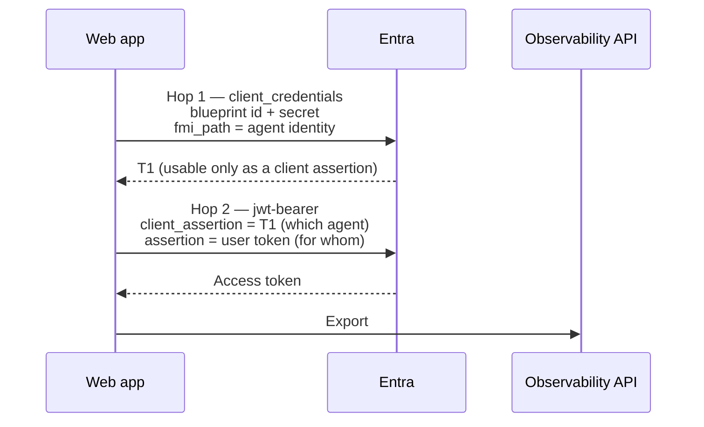

# Token chains by onboarding path

The four scenarios acquire observability tokens through different flows. The required identity,
audience and export route are the same whether we follow a skill-led or manual runbook.
Use this page to compare those flows, then open either guide from the
[scenario index](../01-scenarios/README.md) for the implementation in our stack.

---

## Why this matters more than it looks

Three values have to agree:

```
token azp (or appid)  ==  gen_ai.agent.id  ==  the id in the export route
```

These values identify the acting application; a v1 token can use `appid` where a v2 token uses
`azp`. Agreement is necessary, but it doesn't prove ingestion: the resource audience, grants,
semantic spans and tenant prerequisites must also be correct.

Use the application ID appropriate to the flow, not a service principal's directory object ID:

| Path | `gen_ai.agent.id` is… | Because |
| --- | --- | --- |
| User OBO | The **agent identity** app id | The chain makes the agent identity the acting principal |
| Custom engine OBO | The **bot app registration** client id | The turn carries no agentic identity, so the agent has no credential to make itself the `azp` |
| AI Teammate | The **agentic instance** id | Each installed teammate is a distinct instance; the blueprint rolls activity up |
| Service-to-service | The **agent identity app id** | The blueprint exchange authenticates the child using application permissions |

---

## Chain 1: User OBO (two hops, hand-rolled)

The agent proves *which agent it is* and *who it is acting for*, in one token.



**Hop 1**: the blueprint authenticates as itself and asks for an exchange assertion scoped to the
child agent identity:

```
grant_type   = client_credentials
client_id    = <blueprint id>
scope        = api://AzureADTokenExchange/.default
fmi_path     = <agent identity app id>
```

T1 is not an access token. It is only usable as a client assertion in hop 2.

**Hop 2**: the agent identity performs the OBO exchange:

```
grant_type            = urn:ietf:params:oauth:grant-type:jwt-bearer
client_id             = <agent identity app id>
client_assertion_type = urn:ietf:params:oauth:client-assertion-type:jwt-bearer
client_assertion      = T1
assertion             = <the signed-in user's token>
requested_token_use   = on_behalf_of
```

Both hops POST to `https://login.microsoftonline.com/{tenant}/oauth2/v2.0/token`.

### The two traps

**The user token must be addressed to the blueprint.** Request the scope
`api://<blueprint-id>/access_agent_as_user` when signing the user in. A token for any other
audience will not work as the assertion in hop 2.

**Read the caller's object id correctly.** In .NET, use `GetObjectId()` from
`Microsoft.Identity.Web`, *not* `FindFirst("oid")`. The OIDC handler renames inbound claims, so
`oid` misses, falls through to `ClaimTypes.NameIdentifier`, and yields the pairwise `sub` hash,
which the admin centre cannot resolve to a user. Export succeeds; attribution is blank. This is
the most common cause of "telemetry works but the admin centre shows nothing".

> **A note on MSAL.** Hop 1 does not always need to be hand-rolled. MSAL Python supports
> `fmi_path` natively on `acquire_token_for_client` (verified on MSAL 1.37), and `@azure/msal-node`
> version 5 has both halves, `fmiPath` on the client-credential request and
> `acquireTokenOnBehalfOf` for hop 2. The raw form posts above work everywhere and are what the
> runbooks show, because they match what you would write in any language.

---

## Chain 2: Custom engine OBO (one call, configured not coded)

There is no chain in your code. One call:

```python
await AUTHORIZATION.get_token(context, OBO_AUTH_HANDLER)
```

The Bot Framework Token Service performs the OBO exchange server-side, because the Azure Bot OAuth
connection is scoped to the Observability API. The work lives in `az bot authsetting create`.

Three details in that command are load-bearing:

| Detail | Why |
| --- | --- |
| A **named** scope, e.g. `.../Agent365.Observability.OtelWrite` | `/.default` yields `401 InvalidAudience`: delegated tokens carry scopes, not roles |
| `tokenExchangeUrl = api://botid-<bot-app-client-id>` | Keeps Teams SSO silent |
| `--client-id` = the **bot app** | This is what makes the resulting `azp` the bot app |

### Why the agent id is the bot app

Because the token's `azp` is the bot app, and the agent id must match it. A Teams turn carries no
agentic identity, so the agent has no credential with which to make itself the `azp`.

Use the bot client ID consistently in the token cache, telemetry and export route. The blueprint
remains governance metadata; substituting it or the child ID does not change the token's acting
application.

### Do not use the S2S endpoint here

Set it off explicitly (`a365_use_s2s_endpoint=False` / `UseS2SEndpoint = false`). The
service-to-service route takes application tokens only and refuses a delegated one.

---

## Chain 3: AI Teammate (agentic user)

The teammate acquires a delegated token in its own agent-user context. On .NET, the cache can
register the authorization context needed to obtain it:

```csharp
RegisterObservability(
    agentId,
    tenantId,
    new AgenticTokenStruct(userAuthorization, turnContext, authHandlerName),
    EnvironmentUtils.GetObservabilityAuthenticationScope());
```

The struct binds acquisition to the turn's authorization and handler. The manual implementation
requests the token before model execution as well as exposing the cache to the exporter.

### Not every turn is agentic

A legitimate non-agentic local turn can use the application's plain response path, but it does
not prove tenant telemetry. For an agentic turn, require valid instance and tenant IDs and a token
from the configured agentic-user handler before executing the instrumented operation. Missing
identity or failed token acquisition must not silently select a developer credential or claim
successful instrumentation. An application that also supports human OBO needs that separate
authorization flow; non-agentic does not automatically mean OBO.

### Register the .NET token cache

With `Microsoft.OpenTelemetry` 1.0.7, register `IExporterTokenCache<AgenticTokenStruct>` explicitly.
The agent and exporter must share the same cache:

```csharp
var agenticTokenCache = new AgenticTokenCache();
builder.Services.AddSingleton<IExporterTokenCache<AgenticTokenStruct>>(agenticTokenCache);
```

The [manual AI Teammate guide](../01-scenarios/AI-Teammate-Agent-Identity/3.Runbook-Manual.md)
also resolves the registered token before running the model, so deferred acquisition errors reach
the application's error handler. Node refreshes its built-in cache asynchronously before the
turn; Python acquires the token asynchronously and exposes its cached string through a synchronous
exporter resolver. None of these paths uses an application-only S2S token for an agentic-user turn.

---

## Chain 4: Service-to-service (app-only child identity)

The middleware's incoming token authorizes the webhook call. We don't exchange it for an agent
token or forward it downstream. The agent authenticates separately, using its blueprint's
credential to obtain an assertion for the child, then using that assertion in a resource request.

```text
Blueprint -> Entra:
    client_id = blueprint client ID
    grant_type = client_credentials
    scope = api://AzureADTokenExchange/.default
    fmi_path = agent identity client ID
    credential = blueprint secret, certificate or federated assertion

Agent identity -> Entra:
    client_id = agent identity client ID
    grant_type = client_credentials
    client_assertion = first exchange token
    client_assertion_type = urn:ietf:params:oauth:client-assertion-type:jwt-bearer
    scope = resource/.default
```

These are the two exchanges after obtaining the blueprint credential. A managed identity
assertion adds a credential-acquisition step before them. There is no user `assertion` and no
`requested_token_use=on_behalf_of`. The final access token carries application `roles`.

Use the child client ID for `gen_ai.agent.id` and the export route, not its service principal
object ID. Set `UseS2SEndpoint = true` and supply the custom token resolver described in the
[S2S authentication recipe](https://learn.microsoft.com/microsoft-agent-365/developer/observability-authentication-setup#agent-365-enabled-using-s2s).
That recipe currently uses `api://9b975845-388f-4429-889e-eab1ef63949c/.default`.

The [skill-led](../01-scenarios/Service-to-Service-Agent/3.Runbook.md) and
[manual S2S runbooks](../01-scenarios/Service-to-Service-Agent/3.Runbook-Manual.md) cover the separate
webhook registration, caller app role, agent permission and operational telemetry. Their runtime
token resolver acquires and refreshes the agent's own credential without a signed-in operator.
An ordinary non-agentic service principal can use direct client credentials, but that isn't the
blueprint-derived identity path used in this scenario.

---

## Failure signatures

| Signature | Meaning |
| --- | --- |
| `HTTP 403` on export | `azp` and agent id disagree |
| `401 InvalidAudience` | `/.default` where a named scope was needed, or S2S route with a delegated token |
| `AADSTS82001` | Direct resource client credentials used where the blueprint-to-child exchange is required |
| `Partitioned into 0 identity groups` | No baggage scope was set |
| `Partitioned into 2 identity groups` | Two agent ids in one turn, half the turn is silently dropped |
| `HTTP 200`, admin centre empty | Export acceptance doesn't prove activity ingestion; check the invocation, identity and tenant eligibility |

An `HTTP 200` with an empty `partialSuccess` isn't proof of activity ingestion. The M365 admin
centre consumes semantic invocation records, so an HTTP or model span alone isn't enough.
Check the invocation and its identity attributes, then confirm the tenant's prerequisites.
For S2S, preserve the caller service's attribution without inventing a human user.

Source: [Observability concepts: where your data shows
up](https://learn.microsoft.com/microsoft-agent-365/developer/observability-concepts#where-your-data-shows-up)

---

## Wrapping up

Match the token's acting application, resource and permission type to the exported identity and
endpoint. OBO and agentic-user telemetry use the delegated route; the app-only S2S scenario uses
`/observabilityService`. The authoring route does not change those requirements.

- [Choosing Your Onboarding Path](Choosing-Your-Onboarding-Path.md)
- [Skill-led and manual runbooks for every scenario](../01-scenarios/README.md)
- [Known Skill Gaps](../03-references/Known-Skill-Gaps.md)
